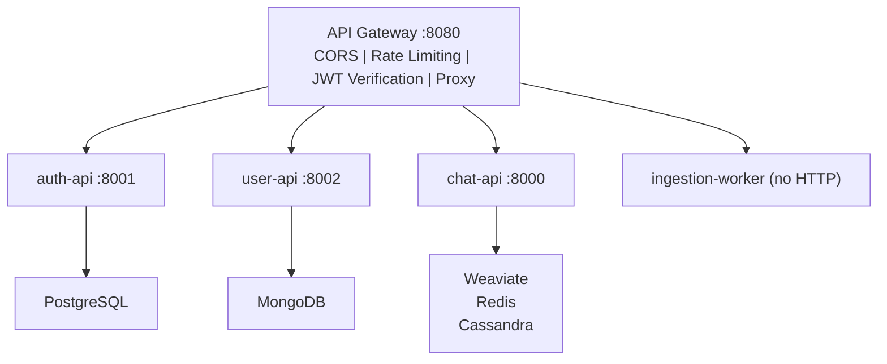
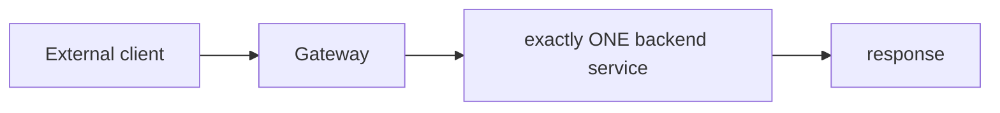

# ADR 001: Microservices and API Gateway

## Status

Accepted.

## Context

The system must support authentication, user profiles, and a RAG-based chat service over US law documents. These three domains have fundamentally different characteristics:

| Domain | Write pattern | Read pattern | Scaling needs | Data store |
| --- | --- | --- | --- | --- |
| Authentication | Low (register, login) | Medium (token verify) | CPU-bound (JWT, Argon2) | PostgreSQL |
| User profiles | Low (profile updates) | Medium (profile reads) | I/O-bound (MongoDB) | MongoDB |
| RAG chat | High (LLM streaming) | High (vector search) | GPU/memory-bound (embeddings, LLM) | Weaviate, Redis, Cassandra |

A single monolith would couple security-sensitive auth code with the heavy RAG pipeline, making it impossible to scale the chat service independently or deploy a security fix without redeploying the entire application.

## Decision

Split the system into five services behind a single API Gateway:



### Service Responsibilities

| Service | Responsibilities | What it does NOT do |
| --- | --- | --- |
| **api-gateway** | CORS, rate limiting (SlowAPI), JWT verification, HTTP/WebSocket proxy, `X-User-Id` injection | No business logic, no data storage |
| **auth-api** | User registration, login, JWT issuance (RS256), refresh tokens, Google OIDC | No profiles, no chat, no RAG |
| **user-api** | Profile CRUD (display name, bio, avatar) | No auth, no passwords, no tokens |
| **chat-api** | RAG pipeline (Weaviate + BM25 + Cohere + LLM), semantic cache, chat memory, WebSocket streaming | No auth, no user profiles |
| **ingestion-worker** | PDF ingestion (Docling + LegalChunker), batch embedding, Weaviate write, cache flush | No HTTP server, no user interaction |

### Communication Pattern

All external traffic flows through the gateway. Internal services communicate only when the gateway proxies a request. There is no service-to-service communication at runtime (auth-api never calls user-api; chat-api never calls auth-api).



The only shared element is the JWT public key, distributed to the gateway and user-api at deployment time (not at runtime).

## Alternatives Considered

### 1. Monolith

```
Single FastAPI app with /auth, /profiles, /chat routes
```

**Pros:** Simple deployment, shared database connections, no network overhead between services.
**Cons:** A memory leak in the RAG pipeline takes down auth. Cannot scale chat independently. Deploying a security fix requires redeploying the entire app. Testing the entire app is slower than testing individual services.

**Why rejected:** The RAG pipeline is resource-heavy and unstable (depends on external APIs — OpenAI, Cohere). Coupling it with authentication is a reliability risk.

### 2. Monolith with Background Worker

```
FastAPI monolith + separate Celery/worker for ingestion
```

**Pros:** Simpler than full microservices. Ingestion is decoupled.
**Cons:** Auth, profiles, and chat are still coupled. Cannot scale chat-api independently.

**Why rejected:** The chat-api needs 2x the CPU/memory of auth-api. In a monolith, scaling up means over-provisioning auth-api.

### 3. BFF (Backend-for-Frontend) Pattern

```
Frontend → BFF → microservices
```

**Pros:** BFF can aggregate responses from multiple services in one request.
**Cons:** For this project, each request hits exactly one backend service. A BFF adds latency and complexity with no aggregation benefit.

**Why rejected:** The API Gateway already provides the routing + auth needed. A BFF would be redundant.

## Consequences

### Positive

- **Independent scaling:** chat-api can scale to 5 replicas while auth-api stays at 2
- **Independent deployment:** Fix a bug in auth-api without touching chat-api
- **Fault isolation:** If Weaviate goes down, only chat-api is affected — auth and profiles still work
- **Technology flexibility:** auth-api uses PostgreSQL, user-api uses MongoDB, chat-api uses Weaviate — each uses the best store for its data model

### Negative

- **Operational complexity:** 6 Dockerfiles, 6 deployments, 6 sets of env vars, 6 health checks
- **Key distribution:** JWT public key must be deployed to 3 services (gateway, user-api, auth-api)
- **Network latency:** Each request adds ~1ms of gateway proxy overhead
- **Debugging:** Distributed tracing is needed to follow a request across services (not yet implemented)
- **Gateway is SPOF:** If the gateway crashes, all services are unreachable. Mitigated by running 2+ replicas with readiness probes.

## Related

- [ADR 002](002-rs256-jwt-and-key-distribution.md) — JWT signing and key distribution
- [Authentication Architecture](../services/authentication_architecture.md) — detailed auth flow
- [RAG and Ingestion](../services/rag_and_ingestion.md) — chat-api and ingestion-worker architecture
