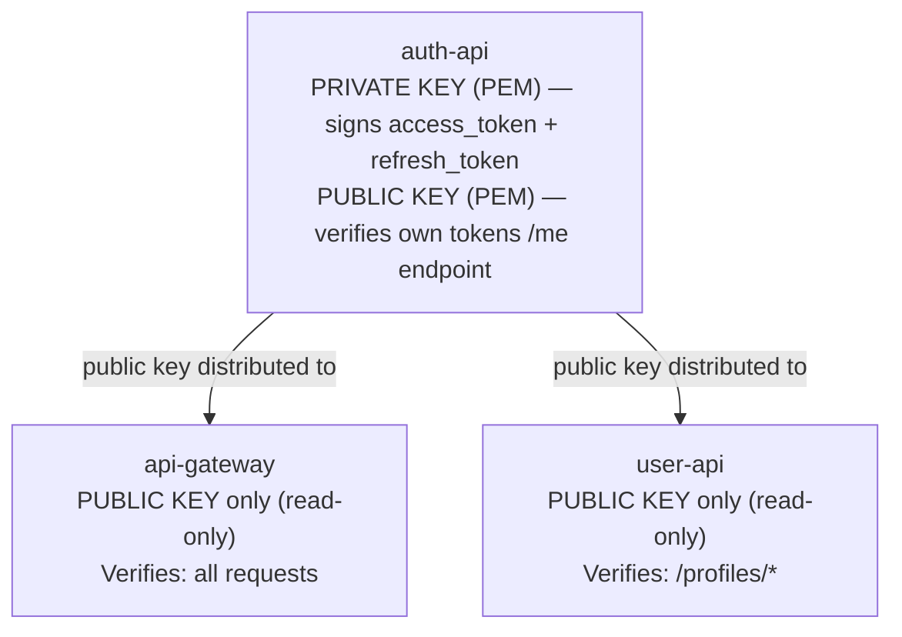

# ADR 002: RS256 JWT and Public Key Distribution

## Status

Accepted.

## Context

Access tokens must be verifiable by the API Gateway and User API without calling the Auth API on every request. The system is microservices-based (ADR 001), so multiple services need to verify tokens independently.

Three JWT signing approaches were considered:

```
HS256 (symmetric):     One secret shared by all services
RS256 (asymmetric):    Private key on signer, public key on verifiers
ES256 (asymmetric):    Same as RS256 but with elliptic curves
```

## Decision

**Algorithm:** RS256 (RSA-SHA256). Auth API signs tokens with a **private** key; Gateway and User API verify with the corresponding **public** key.

### Key Distribution



### Configuration

| Service | Variables | Purpose |
| --- | --- | --- |
| auth-api | `JWT_PRIVATE_KEY` or `JWT_PRIVATE_KEY_PATH` | Sign tokens |
| auth-api | `JWT_PUBLIC_KEY` or `JWT_PUBLIC_KEY_PATH` | Verify tokens (/me) |
| api-gateway | `JWT_PUBLIC_KEY` or `JWT_PUBLIC_KEY_PATH` | Verify all requests |
| user-api | `JWT_PUBLIC_KEY` or `JWT_PUBLIC_KEY_PATH` | Verify /profiles/* |

`_PATH` variants take precedence over inline `_KEY` variants. In Docker, PEM files are mounted into `/run/secrets/`:

```yaml
# docker-compose.yml
auth-api:
  volumes:
    - ./app/auth-api/private.pem:/run/secrets/auth_private.pem:ro
    - ./app/auth-api/public.pem:/run/secrets/auth_public.pem:ro
  environment:
    JWT_PRIVATE_KEY_PATH: /run/secrets/auth_private.pem
    JWT_PUBLIC_KEY_PATH: /run/secrets/auth_public.pem
```

### Token Format

```
Header:
  { "alg": "RS256", "typ": "JWT" }

Payload (access token):
  { "sub": "john_doe", "exp": 1709712000, "iat": 1709710200 }

Payload (refresh token):
  { "sub": "john_doe", "exp": 1710316800, "iat": 1709710200, "type": "refresh" }

Signature:
  RSASSA-PKCS1-v1_5(SHA-256, header.payload, PRIVATE_KEY)
```

## Alternatives Considered

### 1. HS256 (Symmetric HMAC)

```
One shared secret → all services sign AND verify
```

**Pros:** Simpler setup — one secret instead of a key pair. Faster verification (~10x faster than RS256).

**Cons:**
- Every service that can verify can also **forge** tokens. If the gateway is compromised, the attacker can create tokens for any user.
- Rotating the secret requires updating ALL services simultaneously.
- Cannot have "verify-only" services — the secret is all-or-nothing.

**Why rejected:** In a microservices architecture, the blast radius of key compromise matters. With HS256, compromising any verifier compromises the entire auth system.

### 2. ES256 (ECDSA with P-256)

```
Private key (EC) → signer
Public key (EC)  → verifiers
```

**Pros:** Same asymmetric security as RS256. Smaller keys (256-bit vs 2048-bit). Faster signing.

**Cons:**
- Slightly less library support in the Python ecosystem (jose, PyJWT both support it, but fewer examples/docs)
- No practical advantage for this project's scale (we sign ~100 tokens/day, not millions)

**Why not chosen:** RS256 is the most widely supported and documented JWT algorithm. The team familiarity and ecosystem support outweighs ES256's marginal performance advantage.

### 3. Centralized Token Verification (auth-api as verifier)

```
Gateway → HTTP call to auth-api /verify → success/fail
```

**Pros:** auth-api is the single source of truth. No key distribution needed.

**Cons:**
- Every single request adds a network round-trip to auth-api (~5-10ms)
- auth-api becomes a critical bottleneck (every request in the system touches it)
- If auth-api is down, nothing works (not even cached resources)

**Why rejected:** Defeats the purpose of JWT. The whole point of JWT is **stateless verification** — any service with the public key can verify without a network call.

### 4. JWKS (JSON Web Key Set) Endpoint

```
auth-api exposes /.well-known/jwks.json
Other services fetch and cache the public key
```

**Pros:** Dynamic key rotation — services automatically pick up new keys. No manual key distribution.

**Cons:**
- Adds complexity (JWKS fetch + cache + rotation logic in every verifier)
- Requires auth-api to be reachable during key rotation (soft dependency at runtime)
- Overkill for a system with 3 services

**Why not chosen:** With only 3 services consuming the public key, file-based distribution is simpler and more predictable. JWKS would be appropriate for a larger system with 10+ verifiers.

## Consequences

### Positive

- **No shared secret:** Only auth-api holds the private key. Compromise of gateway or user-api does not allow forging tokens.
- **Stateless verification:** Gateway and user-api verify tokens locally in ~0.1ms with no network call.
- **Standard:** RS256 is the default for most JWT libraries and OIDC providers.

### Negative

- **Key rotation requires coordination:** Replace the public key on gateway and user-api when auth-api's keys are rotated. Must deploy public key to verifiers **before** deploying new private key to auth-api.
- **Key distribution is manual:** PEM files must be mounted/configured on 3 services. No automatic propagation.
- **RSA overhead:** RS256 verification is ~10x slower than HS256 (~0.1ms vs ~0.01ms). Irrelevant at this project's scale but matters at millions of verifications per second.

### For Testing

- Generate temporary RSA key pairs in CI: `openssl genrsa -out test_private.pem 2048 && openssl rsa -in test_private.pem -pubout -out test_public.pem`
- Store in `tests/fixtures/` and set `JWT_PRIVATE_KEY_PATH` / `JWT_PUBLIC_KEY_PATH` in conftest.py
- Tests are fully isolated from production keys

### Production Key Management

In production, PEM files are never stored on disk or passed through CI/CD. The application config supports two injection methods — both handled by the `model_validator` in each service's `config.py` at startup with no code changes needed per environment:

| Method | When to use | How |
| --- | --- | --- |
| `JWT_PRIVATE_KEY_PATH` / `JWT_PUBLIC_KEY_PATH` | Docker Compose, local k8s | Mount PEM file as volume; set path as env var |
| `JWT_PRIVATE_KEY` / `JWT_PUBLIC_KEY` | AWS ECS, AWS Secrets Manager | Inject PEM content directly as env var |

For Kubernetes on AWS EKS, the recommended approach is **External Secrets Operator (ESO) + AWS Secrets Manager**:

1. PEM keys are generated locally (`openssl`) and uploaded to AWS Secrets Manager once
2. Terraform registers the EKS cluster's OIDC endpoint with AWS IAM and creates an IAM role with a trust policy scoped to the ESO ServiceAccount
3. ESO runs inside the cluster and authenticates to AWS via IRSA (keyless — EKS mounts a signed token into the ESO pod, which it exchanges for temporary AWS credentials)
4. ESO reads from Secrets Manager and creates the Kubernetes Secrets that pods load via `envFrom.secretRef`
5. GitHub Actions builds and deploys images only — it has no access to secret values

See [Kubernetes — Secrets and ConfigMaps](../infra/kubernetes.md#secrets-and-configmaps) for the full setup with Terraform and Kubernetes manifests.

## Related

- [ADR 001](001-microservices-and-gateway.md) — microservices architecture (why multiple verifiers exist)
- [Authentication Architecture](../services/authentication_architecture.md) — full auth flow with sequence diagrams
