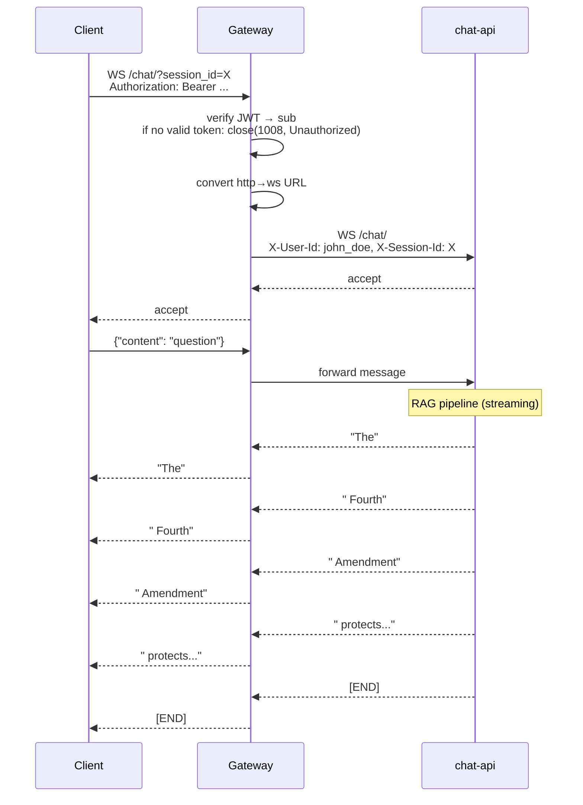
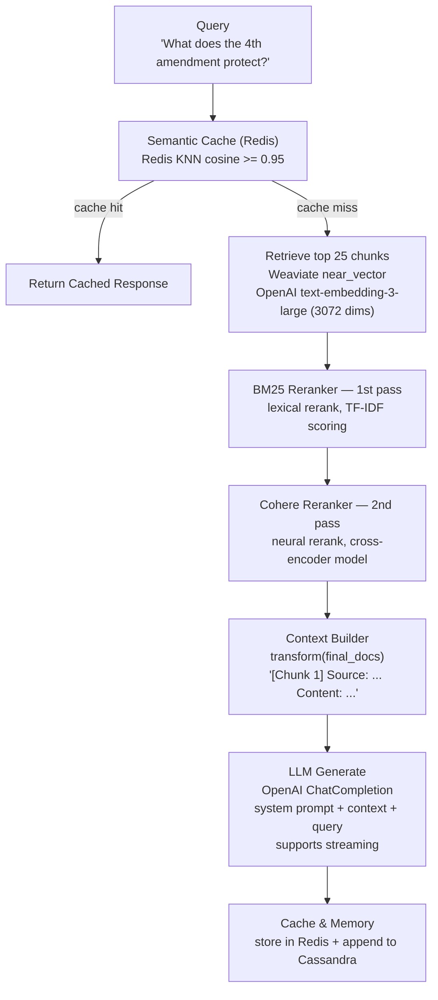

# Chat API

The Chat API provides RAG-based Q&A and conversational chat over US law documents. It is exposed via the gateway at `/chat/*`. It orchestrates Weaviate (vector retrieval), BM25 + Cohere (reranking), OpenAI (LLM), Redis (semantic cache), and Cassandra or in-memory (chat history).

**Source code:** `app/chat-api/`
**Port:** 8000
**Framework:** FastAPI
**Entrypoint:** `src/api/main.py`
**RAG pipeline:** `src/api/services/rag_pipeline.py`

---

## Endpoints

### POST `/chat/`

One-shot RAG query. Sends a question and receives a complete text response.

**Auth:** Bearer token required. Rejected with `401` by the gateway if no valid token is provided.

**Request:**

```json
{
  "content": "What does the Fourth Amendment protect against?"
}
```

**Required headers:**

| Header | Description |
| --- | --- |
| `Authorization` | `Bearer <token>` — required, verified by gateway |

**Optional headers:**

| Header | Description |
| --- | --- |
| `X-Session-Id` | Session identifier for chat memory. If provided, the exchange is stored under `<user_id>:<session_id>` in Cassandra, isolating history per user. Defaults to `<user_id>:default` if omitted. |

**Response (200):**

```json
{
  "response": "The Fourth Amendment protects against unreasonable searches and seizures by the government. It requires that search warrants be issued only upon probable cause, supported by oath or affirmation, and must particularly describe the place to be searched and the persons or things to be seized.\n\nSources:\n- U.S. Constitution, Amendment IV\n- Katz v. United States, 389 U.S. 347 (1967)"
}
```

**Internal flow (full RAG pipeline):**

```
Client → Gateway (/chat/, JWT required → 401 if missing/invalid)
  → chat-api POST /chat/
    → chat_router receives request
    → resolves scoped session: "<user_id>:<session_id>" (or "<user_id>:default")

    Step 1: Load chat history (if session_id provided)
      → chat_memory.get_recent_messages("<user_id>:<session_id>", limit=20)
      → returns List[ChatMessageRecord] for conversation context

    Step 2: Check semantic cache
      → embed_model.get_text_embedding(query) → query_embedding (3072-dim vector)
      → semantic_cache.get(query_embedding)
        → Redis: KNN search on rag_cache_idx
        → if cosine similarity >= 0.95: return cached response
        → if miss: continue to retrieval

    Step 3: Retrieve from Weaviate
      → db.retrieve(query, top_k=25)
        → embed query with OpenAI text-embedding-3-large
        → Weaviate near_vector search → top 25 chunks
        → returns List[Dict] with "text", "source" keys

    Step 4: Rerank (two-pass)
      → first_reranker.rerank(query, 25 chunks) → BM25 top-k
        → BM25 scores: TF-IDF style lexical matching
      → second_reranker.rerank(query, BM25 results) → Cohere top-k
        → Cohere API: neural reranker that understands semantics

    Step 5: Build context
      → transform(final_docs)
        → "[Chunk 1]\nSource: USC Title 18\nContent:\n..."
        → "[Chunk 2]\nSource: Katz v. United States\nContent:\n..."

    Step 6: Generate with LLM
      → llm.generate(query, context)
        → OpenAI ChatCompletion with system prompt + context + query
        → returns full text response

    Step 7: Cache the response
      → semantic_cache.set(query_embedding, response)
        → Redis: HSET rag_cache:<uuid> { vector: <bytes>, response: <text> }
        → Redis: EXPIRE rag_cache:<uuid> 86400  (24h TTL)

    Step 8: Append to chat memory (if session_id)
      → chat_memory.append_messages([
          ChatMessageRecord("<user_id>:<session_id>", timestamp, "user", query),
          ChatMessageRecord("<user_id>:<session_id>", timestamp, "assistant", response),
        ])

    → return { "response": response }
```

---

### WebSocket `/chat/`

Streaming chat. Client sends JSON messages; server streams tokens in real-time.

**Auth:** Bearer token required. Gateway rejects the connection with WebSocket close code `1008` (Policy Violation) if no valid token is provided.

**Connection flow:**



The gateway uses a bidirectional WebSocket proxy (`src/proxy/ws_proxy.py`) that forwards frames in both directions using `asyncio.gather`.

---

### GET `/chat/sessions`

List chat session IDs belonging to the authenticated user.

**Auth:** Bearer token required. Returns `[]` if no valid token is provided (gateway enforces auth, so unauthenticated requests are rejected before reaching chat-api).

**Response (200):**

```json
{
  "session_ids": ["sess_abc123", "sess_def456", "sess_ghi789"]
}
```

Sessions are stored internally as `<user_id>:<session_id>` in Cassandra. The prefix is stripped before returning, so the client sees only the bare session labels they originally sent.

---

### GET `/chat/sessions/{session_id}/messages`

Get recent messages for a specific chat session belonging to the authenticated user.

**Auth:** Bearer token required. The session is looked up as `<user_id>:<session_id>`, so users can only access their own sessions.

**Response (200):**

```json
{
  "messages": [
    {
      "session_id": "sess_abc123",
      "timestamp": "2025-03-01T12:00:00Z",
      "role": "user",
      "content": "What is habeas corpus?"
    },
    {
      "session_id": "sess_abc123",
      "timestamp": "2025-03-01T12:00:05Z",
      "role": "assistant",
      "content": "Habeas corpus is a legal principle that..."
    }
  ]
}
```

---

## RAG Pipeline Deep Dive

### Architecture



### Semantic Cache (Redis)

The cache stores `(query_embedding, response)` pairs using RediSearch vector similarity:

```
 Redis Hash: rag_cache:a1b2c3d4...
   vector:   <3072 float32 bytes>     (12,288 bytes)
   response: "The Fourth Amendment..."

 Redis Index: rag_cache_idx
   Type: HNSW (Hierarchical Navigable Small World)
   Metric: COSINE
   Dimension: 3072
```

**Lookup:** For each new query, compute its embedding and run a KNN-1 search. If the closest cached embedding has cosine similarity >= 0.95 (configurable), return the cached response. This avoids a full RAG pipeline + LLM call, reducing latency from ~3s to ~50ms and saving API costs.

**Invalidation:** The ingestion-worker calls `semantic_cache.flush()` after loading new documents. This deletes all `rag_cache:*` keys and drops the index, forcing subsequent queries through the full pipeline with updated data.

### Two-Pass Reranking

Why two rerankers instead of one?

| Pass | Reranker | Speed | Quality | Input | Output |
| --- | --- | --- | --- | --- | --- |
| 1st | BM25 | Very fast (local) | Medium | 25 chunks from Weaviate | ~10 chunks |
| 2nd | Cohere | Slower (API call) | High | ~10 chunks from BM25 | ~5 chunks |

The BM25 pass is a fast lexical filter that reduces the candidate set cheaply. The Cohere pass applies a neural cross-encoder that deeply understands the query-document relationship but costs money per API call. Running Cohere on 25 chunks would be expensive; running it on 10 pre-filtered chunks is efficient.

---

## Chat Memory

### Interface

```python
class ChatMemoryStore:
    def list_sessions(self, limit: int = 50) -> List[str]: ...
    def get_recent_messages(self, session_id: str, limit: int = 20) -> List[ChatMessageRecord]: ...
    def append_messages(self, messages: List[ChatMessageRecord]) -> None: ...
```

### Implementations

| Implementation | Storage | Durability | Shared across instances |
| --- | --- | --- | --- |
| `CassandraChatMemoryStore` | Cassandra | Persistent | Yes |
| `InMemoryChatMemoryStore` | Python dict | Lost on restart | No |

Selection happens at startup in `lifespan()`:

```python
try:
    memory_store = CassandraChatMemoryStore()   # try Cassandra first
except Exception:
    memory_store = InMemoryChatMemoryStore()    # fallback for dev/tests
```

### Data Model

```
ChatMessageRecord:
  session_id: str        ← groups messages into conversations
  timestamp: datetime    ← ordering within a session
  role: str              ← "user" or "assistant"
  content: str           ← the message text
```

---

## Application Startup (Lifespan)

The `lifespan()` context manager initializes all dependencies:

```python
async def lifespan(app: FastAPI):
    # 1. Weaviate client (vector store)
    db = WeaviateClient(weaviate_url, class_name, openai_key, embedding_model)
    db.connect()

    # 2. LLM client (OpenAI)
    llm = OpenAILLM(api_key, model, prompt_dir)

    # 3. Rerankers
    bm25_reranker = BM25Reranker(top_k=settings.RERANKER_BM25_TOP_K)
    cohere_reranker = CohereReranker(top_k=settings.RERANKER_COHERE_TOP_K)

    # 4. Semantic cache (Redis)
    semantic_cache = SemanticCache(redis_url, ttl, threshold, embed_dim)

    # 5. Chat memory (Cassandra → in-memory fallback)
    try:
        memory_store = CassandraChatMemoryStore()
    except Exception:
        memory_store = InMemoryChatMemoryStore()
    chat_memory = ChatMemoryService(memory_store)

    # Store all on app.state for dependency injection
    app.state.db = db
    app.state.llm = llm
    app.state.first_reranker = bm25_reranker
    app.state.second_reranker = cohere_reranker
    app.state.semantic_cache = semantic_cache
    app.state.embed_model = db.embed_model
    app.state.chat_memory = chat_memory

    yield  # app runs here

    # Cleanup
    semantic_cache.close()
    memory_store.close()   # Cassandra cluster shutdown
    db.close()             # Weaviate client close
```

---

## Configuration

| Variable | Default | Description |
| --- | --- | --- |
| `OPENAI_API_KEY` | (required) | OpenAI API key for embeddings and LLM |
| `OPENAI_LLM_MODEL` | `gpt-4o` | LLM model name |
| `OPENAI_EMBEDDING_MODEL` | `text-embedding-3-large` | Embedding model (3072 dims) |
| `WEAVIATE_URL` | `http://localhost:8080` | Weaviate vector database URL |
| `WEAVIATE_CLASS_NAME` | `document_chunk_embedding` | Weaviate collection name |
| `REDIS_URL` | `redis://localhost:6379` | Redis URL for semantic cache |
| `CACHE_TTL_SECONDS` | `86400` | Cache entry TTL (24 hours) |
| `CACHE_SIMILARITY_THRESHOLD` | `0.95` | Minimum cosine similarity for cache hit |
| `CACHE_EMBED_DIM` | `3072` | Embedding dimension (must match model) |
| `RERANKER_BM25_TOP_K` | `10` | Chunks to keep after BM25 rerank |
| `RERANKER_COHERE_TOP_K` | `5` | Chunks to keep after Cohere rerank |
| `DEFAULT_HOST` | `0.0.0.0` | Server bind host |
| `DEFAULT_PORT` | `8000` | Server bind port |
| `APP_TITLE` | `US Law RAG Controller` | FastAPI title |

---

## Dependency Graph

```
chat-api
  ├── Weaviate          (vector retrieval, embedding via OpenAI)
  ├── Redis             (semantic cache with RediSearch)
  ├── Cassandra         (chat memory — optional, fallback to in-memory)
  ├── OpenAI API        (embeddings: text-embedding-3-large)
  │                     (LLM: gpt-4o)
  ├── Cohere API        (reranker: cross-encoder)
  └── code-shared       (BaseLLM, OpenAILLM, AppError exceptions)
```
