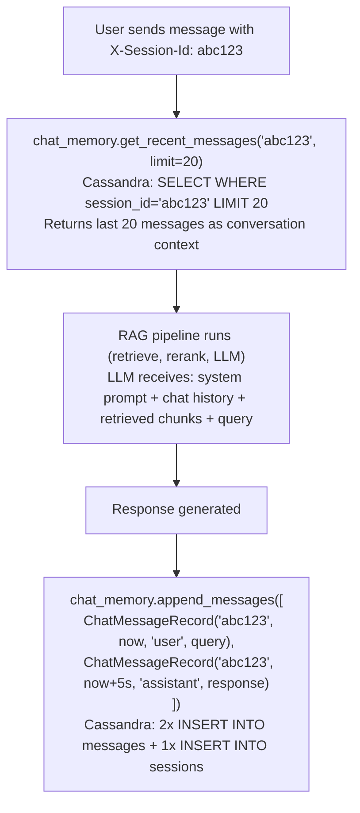

# Cassandra Chat Memory

**Owner:** chat-api
**Purpose:** Persist chat message history per session for RAG context and conversational continuity.
**Image:** `cassandra:5`
**Port:** 9042
**Keyspace:** `chat_memory`

---

## Why Cassandra for Chat History

Chat messages are an **append-heavy, read-recent** workload:
- Every conversation exchange appends 2 rows (user + assistant)
- Reads always fetch the most recent N messages for a single session
- No cross-session joins or complex queries
- Write throughput matters more than read latency

Cassandra is purpose-built for this pattern:

| Property | Cassandra | PostgreSQL | MongoDB |
| --- | --- | --- | --- |
| Write model | LSM tree (append-only) | B-tree (in-place update) | B-tree |
| Write speed | Very fast (sequential I/O) | Moderate (random I/O) | Moderate |
| Partition-based reads | Native (partition key) | Requires careful indexing | Possible but less natural |
| Horizontal scaling | Automatic sharding by partition key | Manual (Citus/pgBouncer) | Built-in but different trade-offs |
| No single master | All nodes serve reads/writes | Primary + replicas | Primary + replicas |

---

## Schema

### Keyspace

```cql
CREATE KEYSPACE IF NOT EXISTS chat_memory
WITH replication = {
    'class': 'SimpleStrategy',
    'replication_factor': '1'
};
```

**SimpleStrategy** with RF=1 is for development. Production should use `NetworkTopologyStrategy` with RF=3:

```cql
CREATE KEYSPACE IF NOT EXISTS chat_memory
WITH replication = {
    'class': 'NetworkTopologyStrategy',
    'us-east-1': 3
};
```

### messages table

```cql
CREATE TABLE IF NOT EXISTS chat_memory.messages (
    session_id text,
    timestamp  timestamp,
    role       text,
    content    text,
    PRIMARY KEY (session_id, timestamp)
) WITH CLUSTERING ORDER BY (timestamp ASC);
```

| Column | Type | Role in primary key | Description |
| --- | --- | --- | --- |
| `session_id` | `text` | **Partition key** | Groups all messages in a conversation onto the same node |
| `timestamp` | `timestamp` | **Clustering key** | Orders messages chronologically within a session |
| `role` | `text` | — | `"user"` or `"assistant"` |
| `content` | `text` | — | The message text |

### sessions table

```cql
CREATE TABLE IF NOT EXISTS chat_memory.sessions (
    session_id text PRIMARY KEY,
    updated_at timestamp
);
```

Used for `list_sessions()` to find recently active sessions. This is a separate table because Cassandra cannot efficiently sort by a non-clustering column across partitions.

---

## Primary Key Deep Dive

```
PRIMARY KEY (session_id, timestamp)
             ─────┬─────  ────┬────
                   │           │
         Partition key    Clustering key
```

**Partition key (`session_id`):** Determines which Cassandra node stores the data. All messages for `session_abc123` go to the same node. This means:
- `SELECT * FROM messages WHERE session_id = 'abc123'` reads from exactly one partition on one node — very fast
- `SELECT * FROM messages` (no WHERE) scans **all** partitions across **all** nodes — very slow (never do this)

**Clustering key (`timestamp`):** Sorts rows within a partition. `CLUSTERING ORDER BY (timestamp ASC)` means messages are physically stored in chronological order. To get the last 20 messages:

```cql
SELECT * FROM messages
WHERE session_id = 'abc123'
ORDER BY timestamp ASC
LIMIT 20;
```

This reads the last 20 rows from a single sorted partition — O(1) seek + O(20) scan.

---

## Query Patterns

### Append messages (after each chat exchange)

```cql
-- User message
INSERT INTO messages (session_id, timestamp, role, content)
VALUES ('abc123', '2025-03-01T12:00:00Z', 'user', 'What is habeas corpus?');

-- Assistant response
INSERT INTO messages (session_id, timestamp, role, content)
VALUES ('abc123', '2025-03-01T12:00:05Z', 'assistant', 'Habeas corpus is a legal principle...');

-- Update session tracker
INSERT INTO sessions (session_id, updated_at)
VALUES ('abc123', '2025-03-01T12:00:05Z');
```

In Cassandra, `INSERT` is actually an upsert — if a row with the same primary key exists, it is overwritten. For the `sessions` table, this keeps `updated_at` current.

### Get recent messages for context

```cql
SELECT session_id, timestamp, role, content
FROM messages
WHERE session_id = 'abc123'
ORDER BY timestamp ASC
LIMIT 20;
```

This is the most frequent read query — called on every chat request with a session ID. It provides conversation context to the LLM.

### List sessions

```cql
SELECT session_id FROM sessions
ORDER BY updated_at DESC
LIMIT 50;
```

Used by the `GET /chat/sessions` endpoint. Note: This query may not work efficiently in Cassandra without a specific table design (the `sessions` table with `session_id` as PK cannot be sorted by `updated_at` across partitions). For production, consider a MATERIALIZED VIEW or a different partition strategy.

---

## Code Implementation

**Source:** `app/chat-api/src/chat_memory/store.py`

### Connection

```python
class CassandraChatMemoryStore(ChatMemoryStore):
    def __init__(self, contact_points: str = "cassandra:9042", keyspace: str = "chat_memory"):
        hosts = [hp.strip() for hp in contact_points.split(",")]
        self._cluster = Cluster(hosts)
        self._session = self._cluster.connect()
        self._ensure_schema(keyspace)       # CREATE KEYSPACE + TABLE IF NOT EXISTS
        self._session.set_keyspace(keyspace)
```

### Schema auto-creation

```python
def _ensure_schema(self, keyspace: str):
    self._session.execute(f"""
        CREATE KEYSPACE IF NOT EXISTS {keyspace}
        WITH replication = {{ 'class': 'SimpleStrategy', 'replication_factor': '1' }}
    """)
    self._session.execute("""
        CREATE TABLE IF NOT EXISTS chat_memory.messages (
            session_id text, timestamp timestamp, role text, content text,
            PRIMARY KEY (session_id, timestamp)
        ) WITH CLUSTERING ORDER BY (timestamp ASC)
    """)
    self._session.execute("""
        CREATE TABLE IF NOT EXISTS chat_memory.sessions (
            session_id text PRIMARY KEY, updated_at timestamp
        )
    """)
```

Tables and keyspace are created on first use. Subsequent startups are no-ops (`IF NOT EXISTS`).

---

## In-Memory Fallback

When Cassandra is unavailable (driver not installed, connection refused, etc.):

```python
class InMemoryChatMemoryStore(ChatMemoryStore):
    def __init__(self):
        self._data: Dict[str, List[ChatMessageRecord]] = defaultdict(list)
```

**Selection at startup:**

```python
try:
    memory_store = CassandraChatMemoryStore()
except Exception:
    memory_store = InMemoryChatMemoryStore()
```

| Mode | Durability | Shared across pods | Use case |
| --- | --- | --- | --- |
| Cassandra | Persistent, replicated | Yes | Production |
| In-memory | Lost on restart | No (per-process) | Dev, tests, `docker-compose.light.yml` |

---

## Data Flow



---

## Storage and Performance

### Per-message cost

```
session_id: ~12 bytes (UUID or short string)
timestamp:  8 bytes
role:       ~10 bytes ("user" or "assistant")
content:    ~200-2000 bytes (typical message)
Cassandra overhead: ~50 bytes per row (tombstone, TTL metadata, etc.)

Total per message: ~300-2100 bytes
```

### Scaling

| Active sessions | Messages/day | Daily storage |
| --- | --- | --- |
| 100 | 2,000 | ~2 MB |
| 10,000 | 200,000 | ~200 MB |
| 100,000 | 2,000,000 | ~2 GB |

### TTL (Optional)

Add row-level TTL to auto-expire old conversations:

```cql
INSERT INTO messages (session_id, timestamp, role, content)
VALUES ('abc123', '2025-03-01T12:00:00Z', 'user', 'question')
USING TTL 2592000;   -- 30 days
```

After 30 days, the row is automatically tombstoned and eventually compacted away. This keeps storage bounded without a cleanup job.

---

## Cassandra vs Other Chat Storage Options

| Option | Pros | Cons |
| --- | --- | --- |
| **Cassandra** (chosen) | Fast appends, partition-based reads, horizontal scaling | Complex to operate, eventual consistency |
| PostgreSQL | ACID, familiar, shared with auth-db | Write-heavy chat may bottleneck; same DB as auth (coupling) |
| MongoDB | Flexible schema, good for small scale | Worse write throughput for append-heavy workload |
| Redis Streams | Fastest for append + recent reads | Data is RAM-bound; not cost-effective for large history |
| DynamoDB | Managed, same partition model | Vendor lock-in, less flexible CQL queries |
