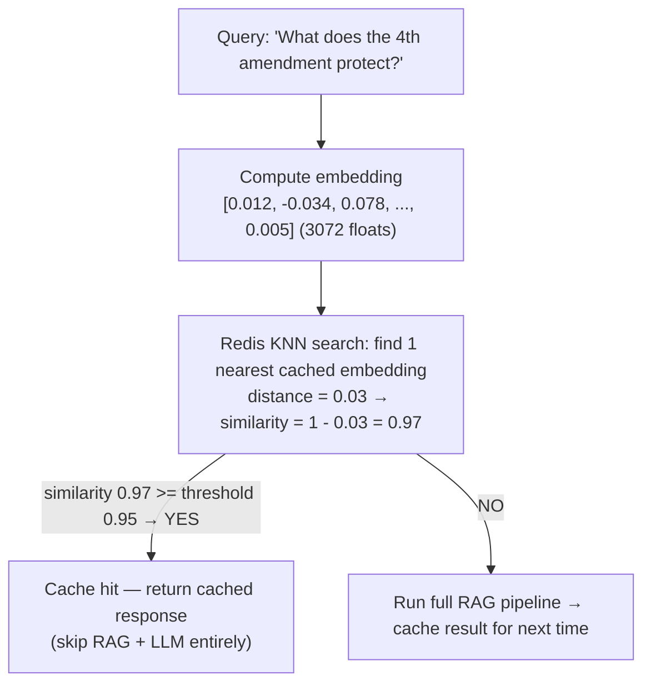

# Redis Semantic Cache

**Owners:** chat-api (get/set, vector index), ingestion-worker (flush only)
**Purpose:** Cache RAG responses by query embedding similarity to reduce LLM calls and latency.
**Image:** `redis/redis-stack:latest` (includes RediSearch module)
**Port:** 6379

---

## How It Works

For every RAG query, the chat-api computes the query's embedding vector (3072-dimensional float array from `text-embedding-3-large`). Before running the full retrieval + LLM pipeline, it checks Redis for a previously cached response whose embedding is "close enough" (cosine similarity >= threshold).



**Impact:**
- Cache hit latency: ~50ms (Redis lookup + embedding API call)
- Cache miss latency: ~3-5s (embedding + Weaviate + rerankers + LLM)
- Cost savings: each cache hit saves one OpenAI LLM call ($0.01-0.03 per query)

---

## Redis Data Structure

### Stored as Redis Hashes

Each cached response is a Redis hash with prefix `rag_cache:`:

```
KEY:    rag_cache:a1b2c3d4e5f6...
FIELDS:
  vector:   <12288 bytes>             ← 3072 × 4 bytes (float32)
  response: "The Fourth Amendment..."  ← full LLM response text
TTL:    86400 seconds (24 hours)
```

### RediSearch Vector Index

```
INDEX NAME: rag_cache_idx
PREFIX:     rag_cache:
TYPE:       HASH

FIELDS:
  vector:
    Type:            VECTOR (HNSW)
    Algorithm:       Hierarchical Navigable Small World
    Dimension:       3072
    Distance Metric: COSINE
  response:
    Type:            TEXT
```

**HNSW** is an approximate nearest neighbor algorithm. It builds a multi-layer graph where each layer has fewer nodes but longer-range connections. Search starts from the top layer and descends, getting more precise at each level. For a cache with 10K entries, KNN-1 search takes < 1ms.

---

## Chat API Usage

**Source:** `app/chat-api/src/semantic_cache.py`

### Initialization

```python
semantic_cache = SemanticCache(
    redis_url="redis://redis:6379",
    ttl_seconds=86400,                  # 24 hours
    similarity_threshold=0.95,          # 95% cosine similarity
    embed_dim=3072,                     # text-embedding-3-large
)
```

### Get (cache lookup)

```python
def get(self, query_embedding: List[float]) -> Optional[str]:
    vec_bytes = np.array(query_embedding, dtype=np.float32).tobytes()
    q = Query("*=>[KNN 1 @vector $vec AS score]")
        .return_fields("response", "score")
        .sort_by("score")
        .paging(0, 1)
        .dialect(2)
    results = r.ft("rag_cache_idx").search(q, query_params={"vec": vec_bytes})

    if not results.docs:
        return None

    distance = float(results.docs[0].score)
    similarity = 1.0 - distance          # RediSearch COSINE returns distance
    if similarity < self.similarity_threshold:
        return None

    return results.docs[0].response
```

**Key detail:** RediSearch returns **cosine distance** (0 = identical, 2 = opposite), not cosine similarity. The conversion is `similarity = 1 - distance`. A distance of 0.05 means 95% similarity.

### Set (cache store)

```python
def set(self, query_embedding: List[float], response: str) -> None:
    key = f"rag_cache:{uuid.uuid4().hex}"
    vec_bytes = np.array(query_embedding, dtype=np.float32).tobytes()
    r.hset(key, mapping={"vector": vec_bytes, "response": response})
    r.expire(key, self.ttl_seconds)      # auto-delete after 24h
```

### Flush (cache invalidation)

```python
def flush(self) -> None:
    for key in r.scan_iter(match="rag_cache:*", count=100):
        r.delete(key)
    r.ft("rag_cache_idx").dropindex(delete_documents=False)
```

---

## Ingestion Worker Usage

**Source:** `app/ingestion-worker/src/semantic_cache.py`

The ingestion worker has a **flush-only** semantic cache. After loading new documents into Weaviate, it must clear the cache so subsequent queries do not return answers based on old data:

```python
cache = SemanticCache(redis_url=settings.REDIS_URL, ...)
if cache.enabled:
    cache.flush()
    cache.close()
```

**Why flush after ingestion?** If a user asks "What is the penalty for tax fraud?" and gets a cached answer from 2024 data, then new 2025 law documents are ingested, the cached answer might be outdated or wrong. Flushing forces the next query through the full pipeline with updated Weaviate data.

**Contract:** Both chat-api and ingestion-worker use the same `CACHE_PREFIX = "rag_cache:"` and `INDEX_NAME = "rag_cache_idx"`. This is not enforced by a shared library — both services hardcode the same constants. A breaking change in one must be mirrored in the other.

---

## Configuration

| Variable | Default | Service | Description |
| --- | --- | --- | --- |
| `REDIS_URL` | `redis://localhost:6379` | both | Redis connection string |
| `CACHE_TTL_SECONDS` | `86400` | chat-api | How long cached responses live (24h) |
| `CACHE_SIMILARITY_THRESHOLD` | `0.95` | chat-api | Min similarity for a cache hit |
| `CACHE_EMBED_DIM` | `3072` | both | Embedding dimension (must match model) |

---

## Threshold Tuning

| Threshold | Behavior | Use case |
| --- | --- | --- |
| `0.99` | Only near-exact queries match | Maximum accuracy, minimal cache hits |
| `0.95` | Similar queries match (current default) | Good balance of accuracy and savings |
| `0.90` | Broader matching, may return irrelevant answers | Aggressive caching, risk of wrong answers |
| `0.80` | Very broad — "What is a tort?" matches "What is criminal tort?" | Too aggressive for legal Q&A |

For legal content where precision matters, `0.95` is conservative and appropriate. Lower thresholds risk returning answers about the wrong statute or case.

---

## Memory and Storage

### Per-entry cost

```
Key name:     ~40 bytes (prefix + UUID hex)
Vector:       3072 × 4 bytes = 12,288 bytes ≈ 12 KB
Response:     ~500-2000 bytes (typical LLM answer)
Redis overhead: ~200 bytes per key

Total per entry: ~13-15 KB
```

### Scaling

| Cached queries | Memory usage |
| --- | --- |
| 1,000 | ~15 MB |
| 10,000 | ~150 MB |
| 100,000 | ~1.5 GB |

With a 24-hour TTL and moderate traffic (1000 unique queries/day), the cache uses ~15 MB — well within typical Redis limits. The TTL auto-evicts old entries, keeping memory bounded.

---

## Why Redis (Not In-Memory Dict or PostgreSQL pgvector)

| Option | Speed | Persistence | Shared across pods | Vector search |
| --- | --- | --- | --- | --- |
| **Redis Stack** | ~1ms | RDB/AOF snapshots | Yes | Native HNSW via RediSearch |
| In-memory dict | ~0.01ms | None | No | Would need custom implementation |
| PostgreSQL pgvector | ~5-10ms | Full ACID | Yes | ivfflat/hnsw index |

Redis wins because:
- Fast enough for the cache use case (sub-millisecond)
- Already in the stack for sessions/rate limiting
- RediSearch provides native vector similarity without a custom implementation
- Temporary data (cache) doesn't need ACID guarantees

---

## Persistence (Why Redis Needs a Volume)

Redis stores data in RAM during operation but writes to disk for durability:

| Mechanism | File | Trigger | Recovery speed |
| --- | --- | --- | --- |
| **RDB snapshot** | `dump.rdb` | Every N seconds after M writes (configurable) | Fast (load full dataset) |
| **AOF** | `appendonly.aof` | Log every write | Slower (replay operations) |

Without a persistent volume, a Redis pod restart (crash, node drain, deploy) wipes:
- All cached RAG responses (cold cache → every query hits the full pipeline)
- All session data (all users logged out)
- All rate limiter state (rate limits reset)

With a volume mounted at `/data`, Redis loads `dump.rdb` on startup and recovers state within seconds.
