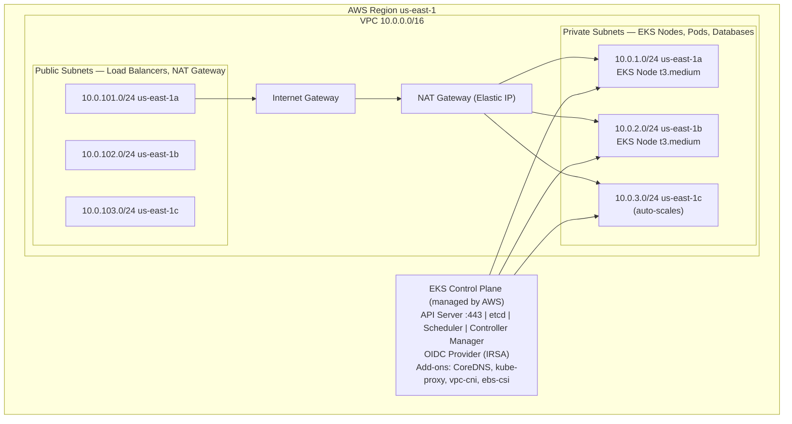

# Terraform — AWS EKS Provisioning

This document describes the Terraform configuration used to provision the AWS EKS cluster and the supporting VPC network for the US Law RAG system.

All Terraform files live in `terraform/`.

---

## Overview

The configuration uses two official Terraform modules:

- **`terraform-aws-modules/vpc/aws`** — creates the VPC, public/private subnets across three AZs, an Internet Gateway, and a single NAT Gateway.
- **`terraform-aws-modules/eks/aws`** — creates the EKS control plane, OIDC provider (IRSA), managed add-ons, and a managed node group.

The EKS API endpoint is publicly accessible by default; restrict `cluster_endpoint_public_access_cidrs` in the provider before deploying to production.

---

## Architecture



---

## Files

| File | Purpose |
| --- | --- |
| `main.tf` | Provider config, VPC module, EKS module with all settings |
| `variables.tf` | All tuneable inputs (region, cluster name, node sizing, tags) |
| `outputs.tf` | Cluster endpoint, OIDC URL, subnet IDs, kubeconfig command |

---

## Key Design Decisions

### Private Subnets for Nodes

Worker nodes live in private subnets — they have no public IP. Outbound internet access (to pull Docker images from ECR, download packages) goes through the NAT Gateway. Inbound traffic from the internet hits the load balancer in the public subnets.

**Security benefit:** An attacker who compromises a pod cannot directly reach the internet without going through the NAT, which only allows outbound connections.

### IRSA (IAM Roles for Service Accounts)

`enable_irsa = true` creates an OIDC identity provider that allows individual Kubernetes pods to assume AWS IAM roles. Without IRSA, all pods on a node share the node's IAM role — a security anti-pattern.

```
With IRSA:
  Pod (ingestion-worker) → ServiceAccount → IAM Role → S3 read-only
  Pod (frontend)         → ServiceAccount → no IAM role → no AWS access
```

### EBS CSI Driver

The `aws-ebs-csi-driver` add-on is critical — without it, `PersistentVolumeClaim` resources cannot provision EBS volumes. StatefulSets for databases would be stuck in `Pending`.

### Single NAT Gateway

`single_nat_gateway = true` routes all three private subnets through one NAT Gateway. This saves ~$64/month but creates a single point of failure. For production HA, set `single_nat_gateway = false` to create one NAT per AZ (~$96/month for 3 NATs).

### Remote State

The `backend "s3"` block is commented out. Before team collaboration or production:

```hcl
terraform {
  backend "s3" {
    bucket         = "rag-us-law-terraform-state"
    key            = "rag-us-law/terraform.tfstate"
    region         = "us-east-1"
    dynamodb_table = "terraform-state-lock"
    encrypt        = true
  }
}
```

---

## Variables

| Variable | Default | Description |
| --- | --- | --- |
| `aws_region` | `us-east-1` | AWS region |
| `cluster_name` | `rag-us-law` | EKS cluster name |
| `cluster_version` | `1.32` | Kubernetes version |
| `vpc_cidr` | `10.0.0.0/16` | VPC CIDR block (65,536 IPs) |
| `node_instance_types` | `["t3.medium"]` | EC2 instance types (2 vCPU, 4 GB RAM) |
| `node_min_size` | `1` | Minimum nodes (auto-scaling lower bound) |
| `node_max_size` | `5` | Maximum nodes (auto-scaling upper bound) |
| `node_desired_size` | `2` | Starting node count |
| `tags` | see file | Common tags: Project, Environment, ManagedBy |

### Node Sizing Guide

| Instance type | vCPU | RAM | Monthly cost | Fits |
| --- | --- | --- | --- | --- |
| `t3.medium` (default) | 2 | 4 GB | ~$30 | Small workloads, dev |
| `t3.large` | 2 | 8 GB | ~$60 | Medium workloads |
| `m5.large` | 2 | 8 GB | ~$70 | Production (no burst credits) |
| `m5.xlarge` | 4 | 16 GB | ~$140 | Heavy workloads (Weaviate, Cassandra) |

For this project's workload (6 app services + 7 data stores), `2x m5.large` or `3x t3.large` is a good production starting point.

---

## Outputs

| Output | Description |
| --- | --- |
| `cluster_name` | EKS cluster name |
| `cluster_endpoint` | Kubernetes API server URL |
| `cluster_certificate_authority_data` | Base64 CA data (sensitive) |
| `cluster_oidc_issuer_url` | OIDC provider URL for IRSA |
| `vpc_id` | VPC ID |
| `private_subnets` | Private subnet IDs |
| `public_subnets` | Public subnet IDs |
| `kubeconfig_command` | Ready-to-run `aws eks update-kubeconfig` command |

---

## Usage

```bash
cd terraform

# 1. Initialize providers and modules
terraform init

# 2. Preview changes
terraform plan

# 3. Apply (takes 15-25 minutes)
terraform apply

# 4. Configure kubectl
$(terraform output -raw kubeconfig_command)

# 5. Verify
kubectl get nodes
kubectl get pods -n kube-system
```

### Execution Timeline

| Step | Duration | What happens |
| --- | --- | --- |
| VPC + subnets | ~30s | Creates VPC, 6 subnets, route tables |
| NAT Gateway | ~2min | Allocates Elastic IP, creates NAT |
| EKS control plane | ~10-15min | Creates API server, etcd, OIDC provider |
| Managed add-ons | ~3min | Installs CoreDNS, kube-proxy, vpc-cni, ebs-csi |
| Node group | ~5min | Launches EC2 instances, joins to cluster |
| **Total** | **~15-25min** | |

### Destroying

```bash
terraform destroy
# WARNING: Deletes all resources including EBS volumes (database data)
# Only use for non-production environments
```

---

## What's Missing (Production Additions)

| Resource | Terraform code needed | Purpose |
| --- | --- | --- |
| ECR repositories | `aws_ecr_repository` × 6 | Docker image storage (one per service) |
| S3 bucket (state) | `aws_s3_bucket` + `aws_dynamodb_table` | Terraform remote state + locking |
| S3 bucket (data) | `aws_s3_bucket` | Document storage for ingestion |
| Route53 hosted zone | `aws_route53_zone` + records | DNS management |
| ACM certificate | `aws_acm_certificate` | TLS certificate for HTTPS |
| IAM role for GitHub Actions | `aws_iam_role` with OIDC trust | CI/CD pipeline authentication |

---

## Cost Breakdown (Approximate Monthly)

| Resource | Cost |
| --- | --- |
| EKS control plane | $73 |
| 2x t3.medium nodes | $60 |
| NAT Gateway (single) | $32 |
| NAT data transfer | ~$5-20 (depends on traffic) |
| EBS (50 GB per node) | $8 |
| EBS (database PVCs) | Varies ($0.08/GB/month) |
| **Total baseline** | **~$180-200/month** |

This is the minimum for a running cluster before application load. Costs scale with node count, storage, and data transfer.
