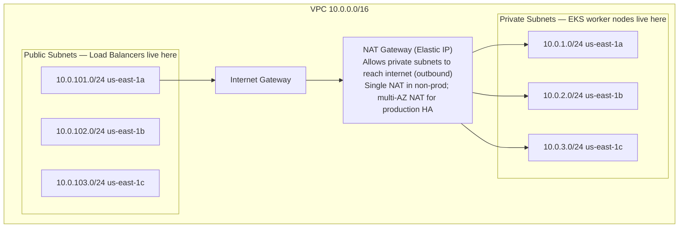
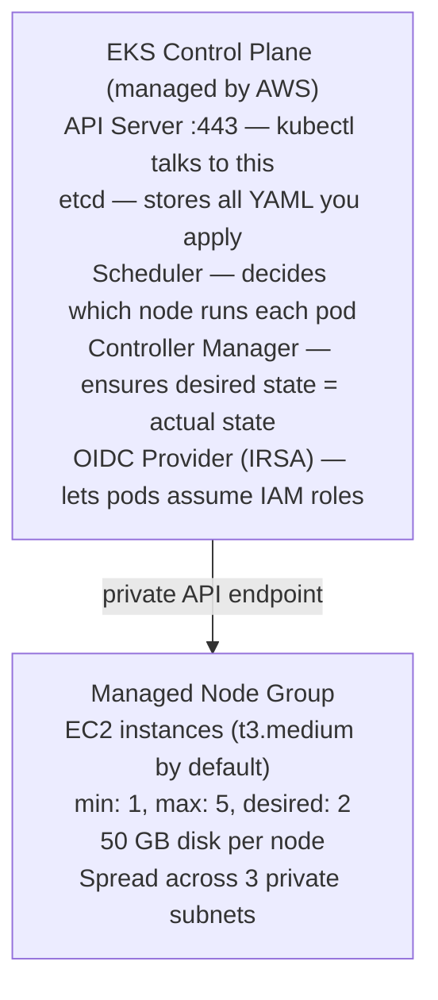
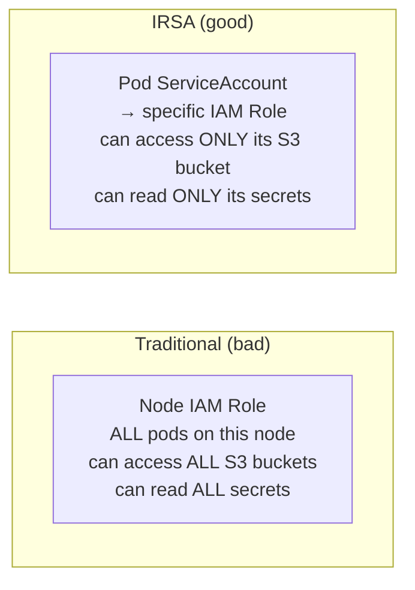

# Lifecycle 1 — Terraform: Cloud Infrastructure

> **Frequency:** Run once to create, then only when infrastructure changes (new node group, different instance type, new AWS service).
> **Tool:** Terraform
> **Files:** `terraform/main.tf`, `terraform/variables.tf`, `terraform/outputs.tf`
> **Who runs it:** DevOps engineer (locally or via a Terraform CI pipeline).

---

## What This Lifecycle Does

Before any application code can run, the underlying cloud resources must exist. Terraform declaratively provisions everything in AWS — you describe the desired state in `.tf` files, and Terraform figures out the API calls to create it.

Think of this as **buying and assembling the server rack**. After this lifecycle completes, you have a functional but empty Kubernetes cluster.

---

## What Gets Created (Resource by Resource)

### 1. VPC (Virtual Private Cloud)



**Why three subnets in three AZs?** If `us-east-1a` has a datacenter fire, your pods reschedule to nodes in `us-east-1b` and `us-east-1c` automatically.

**Why private subnets for nodes?** Worker nodes have no public IP. They reach the internet only through the NAT Gateway (to pull Docker images, etc.) but the internet cannot reach them directly. This is a fundamental security boundary.

**Subnet tags** are critical — EKS uses them to auto-discover where to place load balancers:

```hcl
public_subnet_tags = {
  "kubernetes.io/role/elb" = "1"            # internet-facing ALB/NLB goes here
}
private_subnet_tags = {
  "kubernetes.io/role/internal-elb" = "1"   # internal load balancers go here
}
```

Without these tags, `kubectl apply` of an Ingress with an AWS load balancer will fail silently — the AWS Load Balancer Controller will not know which subnets to use.

### 2. EKS Cluster (Control Plane)

The control plane is the Kubernetes brain — it runs the API server, etcd (cluster state database), scheduler, and controller manager. AWS manages all of this; you never SSH into the control plane.



**`cluster_endpoint_public_access = true`** means you can run `kubectl` from your laptop. In production, restrict this to your office/VPN CIDR:

```hcl
cluster_endpoint_public_access       = true
cluster_endpoint_public_access_cidrs = ["203.0.113.0/24"]   # your office IP range
```

### 3. EKS Managed Add-ons

These are cluster-level components that EKS installs and auto-upgrades:

| Add-on | What it does | Why you need it |
| --- | --- | --- |
| **CoreDNS** | In-cluster DNS server | So `auth-db` resolves to `auth-db.rag-us-law.svc.cluster.local` |
| **kube-proxy** | Network rules on each node | Routes ClusterIP traffic to the correct pod |
| **vpc-cni** | Assigns VPC IPs to pods | Each pod gets a real VPC IP — no overlay network overhead |
| **aws-ebs-csi-driver** | Provisions EBS volumes | So your `PersistentVolumeClaim` actually creates a real AWS disk |

The EBS CSI driver is especially critical — without it, StatefulSets for Postgres, Mongo, Redis, etc. will be stuck in `Pending` because Kubernetes has no way to create storage.

### 4. IAM and IRSA (IAM Roles for Service Accounts)

`enable_irsa = true` creates an OIDC identity provider. This allows individual pods to assume AWS IAM roles without giving the entire node a blanket permission set.



Example: the `ingestion-worker` pod needs S3 access to read uploaded law documents. With IRSA, only that pod's ServiceAccount gets `s3:GetObject` — the `frontend` pod on the same node cannot access S3 at all.

### 5. What's Missing (Should Be Added to Terraform)

Your current `main.tf` covers VPC + EKS. Production also needs:

| Resource | Why |
| --- | --- |
| **ECR repositories** (one per service) | Where Docker images are stored after CI builds them |
| **S3 bucket** for Terraform remote state | So the team shares state and `terraform apply` doesn't conflict |
| **DynamoDB table** for state locking | Prevents two people from running `terraform apply` simultaneously |
| **Route53 hosted zone** | DNS management for `yourdomain.com` |
| **ACM certificate** | TLS certificate for HTTPS |
| **S3 bucket** for document storage | If ingestion-worker reads uploaded PDFs from S3 |

---

## Terraform State: The Most Dangerous Part

Terraform state (`terraform.tfstate`) is a JSON file that maps your `.tf` declarations to real AWS resource IDs. If you lose it, Terraform doesn't know what it created and cannot manage or destroy anything.

### Local State (Current Setup — Dangerous for Teams)

```
developer A: terraform apply  → creates VPC
developer B: terraform apply  → doesn't know about VPC → tries to create another
             → CONFLICT: duplicate resources, orphaned infrastructure
```

### Remote State (Production Setup)

```hcl
terraform {
  backend "s3" {
    bucket         = "rag-us-law-terraform-state"
    key            = "rag-us-law/terraform.tfstate"
    region         = "us-east-1"
    dynamodb_table = "terraform-state-lock"    # prevents concurrent applies
    encrypt        = true                       # state contains sensitive data
  }
}
```

```
developer A: terraform apply → acquires DynamoDB lock → modifies state in S3 → releases lock
developer B: terraform apply → tries to acquire lock → BLOCKED until A finishes
             → no conflict possible
```

The S3 bucket and DynamoDB table must be created **manually** (or by a separate bootstrap Terraform config) before the main config can use them. This is a chicken-and-egg problem that every Terraform project faces.

---

## Execution Flow (Step by Step)

```
Prerequisites:
  - AWS CLI configured with admin credentials
  - Terraform >= 1.6 installed

Step 1: Initialize
  $ cd terraform
  $ terraform init

  What happens:
    - Downloads hashicorp/aws provider (~5.0)
    - Downloads terraform-aws-modules/vpc/aws (~5.0)
    - Downloads terraform-aws-modules/eks/aws (~20.0)
    - Creates .terraform/ directory with provider binaries
    - Creates .terraform.lock.hcl with exact versions (commit this)

Step 2: Plan
  $ terraform plan

  What happens:
    - Reads current state (local or S3)
    - Compares desired state (.tf files) with actual state
    - Shows diff: "12 resources to create, 0 to change, 0 to destroy"
    - No changes are made to AWS

  Output looks like:
    + module.vpc.aws_vpc.this
    + module.vpc.aws_subnet.private[0]
    + module.vpc.aws_subnet.private[1]
    + module.vpc.aws_subnet.private[2]
    + module.vpc.aws_subnet.public[0]
    + module.vpc.aws_subnet.public[1]
    + module.vpc.aws_subnet.public[2]
    + module.vpc.aws_nat_gateway.this
    + module.eks.aws_eks_cluster.this
    + module.eks.aws_eks_node_group.this
    ...

Step 3: Apply
  $ terraform apply

  What happens (takes 15-25 minutes):
    1. Creates VPC                           (~10 seconds)
    2. Creates subnets                       (~10 seconds)
    3. Creates Internet Gateway              (~10 seconds)
    4. Creates NAT Gateway                   (~2 minutes — allocates Elastic IP)
    5. Creates route tables + associations   (~30 seconds)
    6. Creates EKS cluster                   (~10-15 minutes — this is the slow part)
    7. Waits for cluster to be ACTIVE
    8. Installs managed add-ons              (~3 minutes)
    9. Creates managed node group            (~5 minutes — launches EC2 instances)
    10. Writes outputs to state

  After completion:
    - cluster_endpoint = "https://ABCDEF1234.gr7.us-east-1.eks.amazonaws.com"
    - kubeconfig_command = "aws eks update-kubeconfig --region us-east-1 --name rag-us-law"

Step 4: Configure kubectl
  $ aws eks update-kubeconfig --region us-east-1 --name rag-us-law

  What happens:
    - Writes to ~/.kube/config
    - Adds cluster endpoint, CA certificate, and an exec-based auth token
    - Now `kubectl get nodes` works and shows your EC2 instances

Step 5: Verify
  $ kubectl get nodes
  NAME                                        STATUS   ROLES    AGE   VERSION
  ip-10-0-1-42.ec2.internal                   Ready    <none>   5m    v1.32.0
  ip-10-0-2-88.ec2.internal                   Ready    <none>   5m    v1.32.0

  $ kubectl get pods -n kube-system
  coredns-xxxxx-yyyyy                          1/1     Running   0     5m
  aws-node-xxxxx                               2/2     Running   0     5m
  kube-proxy-xxxxx                             1/1     Running   0     5m
  ebs-csi-controller-xxxxx                     6/6     Running   0     5m
```

---

## Day-2 Operations

### Scaling Nodes

```bash
# Change in variables.tf:
#   node_desired_size = 3
#   node_max_size     = 10
terraform apply
# → EKS adds 1 more EC2 instance to the node group
# → existing pods untouched; new pods can now schedule on the new node
```

### Upgrading Kubernetes Version

```bash
# Change in variables.tf:
#   cluster_version = "1.33"
terraform apply
# → EKS upgrades the control plane first (~15 min)
# → Then you must update the node group (Terraform handles this)
# → Nodes are drained and replaced one by one (rolling update)
# → Pods reschedule to new nodes — zero downtime if you have 2+ replicas
```

### Destroying Everything

```bash
terraform destroy
# → Deletes everything in reverse order
# → WARNING: this deletes EBS volumes too — all database data is gone
# → Only use for non-production environments
```

---

## Cost Breakdown (Approximate)

| Resource | Monthly cost (us-east-1) |
| --- | --- |
| EKS control plane | $73 |
| 2x t3.medium nodes | $60 ($30 each) |
| NAT Gateway + data transfer | $32 + $0.045/GB |
| EBS volumes (50 GB gp3 per node) | $8 ($0.08/GB) |
| EBS volumes for databases (PVCs) | Varies by usage |
| **Total baseline** | **~$175/month** |

This is the minimum cost for a running cluster before any application load.

---

## Relationship to Lifecycle 2

After Terraform completes, you have:

| What exists | What doesn't exist yet |
| --- | --- |
| VPC, subnets, routing | Namespaces |
| EKS cluster, nodes | Databases (Postgres, Mongo, Redis, etc.) |
| EBS CSI driver (can create volumes) | PersistentVolumeClaims |
| IAM roles, OIDC provider | Secrets, ConfigMaps |
| CoreDNS, kube-proxy | Application deployments |

The cluster is like a brand new laptop — the OS is installed, but no applications are running. Lifecycle 2 installs the platform.
