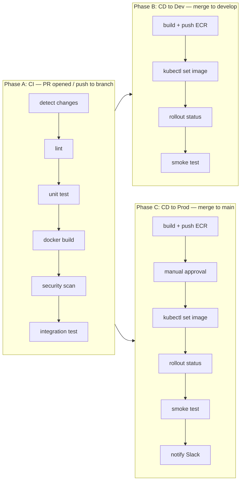
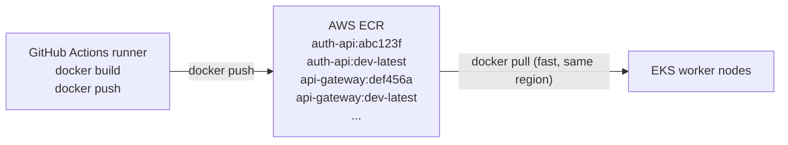
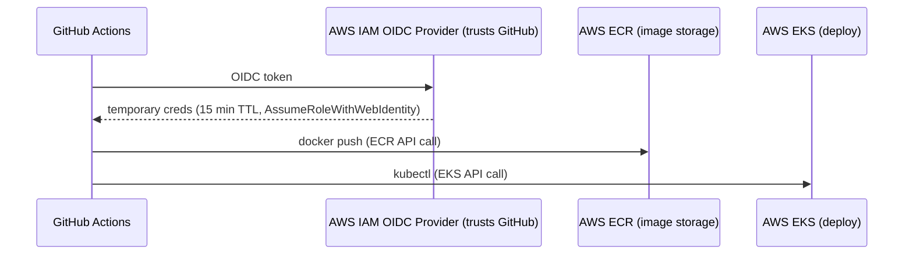
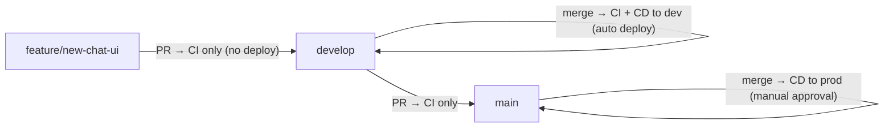

# Lifecycle 3 — App CI/CD

> **Frequency:** Runs on every git push and every PR.
> **Tools:** GitHub Actions, Docker, AWS ECR, kubectl
> **Who runs it:** Fully automated — triggered by git events.

---

## What This Lifecycle Does

This is the pipeline developers interact with daily. Every time code is pushed, GitHub Actions automatically lints, tests, builds Docker images, pushes them to a registry, and deploys them to the Kubernetes cluster with zero downtime.

Unlike Lifecycles 1 and 2 which run rarely, this pipeline runs **hundreds of times** over the life of the project.

---

## The Six Services in the Pipeline

Each service has its own Dockerfile and can be built independently:

| Service | Dockerfile | Port | What it does |
| --- | --- | --- | --- |
| `api-gateway` | `app/api-gateway/Dockerfile` | 8080 | Routes API calls to backend services |
| `auth-api` | `app/auth-api/Dockerfile` | 8001 | Authentication, JWT, user registration |
| `user-api` | `app/user-api/Dockerfile` | 8002 | User profiles and preferences |
| `chat-api` | `app/chat-api/Dockerfile` | 8000 | RAG pipeline, LLM calls, chat |
| `ingestion-worker` | `app/ingestion-worker/Dockerfile` | — | Background document processing |
| `frontend` | `app/frontend/Dockerfile` | 80 | React/Vite UI served by NGINX |

---

## Pipeline Phases



---

## Phase A: Continuous Integration (CI)

Runs on **every PR** and **every push to a branch**. Goal: catch bugs before they reach any environment.

### Step 1: Detect Changes

Not every push changes every service. If a developer only modified `app/auth-api/`, there is no reason to rebuild `frontend` or `chat-api`. The `dorny/paths-filter` action compares the diff and outputs which services changed.

```yaml
- uses: dorny/paths-filter@v3
  id: filter
  with:
    filters: |
      api-gateway:
        - 'app/api-gateway/**'
        - 'libs/**'                # shared library changes affect all services
      auth-api:
        - 'app/auth-api/**'
        - 'libs/**'
      user-api:
        - 'app/user-api/**'
        - 'libs/**'
      chat-api:
        - 'app/chat-api/**'
        - 'libs/**'
      ingestion-worker:
        - 'app/ingestion-worker/**'
        - 'libs/**'
      frontend:
        - 'app/frontend/**'
```

**Why `libs/**` triggers all services:** The `libs/` folder contains shared code (e.g. common models, utility functions). A change there could affect any service that imports it.

**Output example:** If the PR only touches `app/auth-api/routes.py` and `app/auth-api/tests/`, the output is:

```
api-gateway: false
auth-api: true        ← only this one runs through the pipeline
user-api: false
chat-api: false
ingestion-worker: false
frontend: false
```

### Step 2: Lint

For Python services:

```bash
ruff check app/auth-api/       # fast linter (replaces flake8)
ruff format --check app/auth-api/   # formatting check
mypy app/auth-api/              # type checking (optional)
```

For the frontend:

```bash
cd app/frontend
npm ci
npm run lint                    # ESLint
npm run type-check              # TypeScript compiler
```

**Why lint in CI?** Catches style issues, unused imports, type errors, and common bugs *before* they reach code review. Reviewers focus on logic, not formatting.

### Step 3: Unit Tests

```bash
# Python services
cd app/auth-api
pip install -r requirements.txt
pytest --cov=. --cov-report=xml

# Frontend
cd app/frontend
npm ci
npm test -- --coverage
```

**Coverage reports** are uploaded as artifacts and can be required to meet a threshold (e.g., 80%) before the PR is mergeable.

### Step 4: Docker Build (No Push)

Build the image to verify the Dockerfile works, but do not push it to the registry — this is just a PR, not a deployment.

```bash
docker build \
  -f app/auth-api/Dockerfile \
  -t auth-api:${{ github.sha }} \
  .
```

Using `github.sha` (the full commit hash, e.g. `abc123def456`) as the tag guarantees every build is uniquely identified and traceable to an exact commit.

### Step 5: Security Scan

```bash
trivy image --exit-code 1 --severity CRITICAL,HIGH auth-api:${{ github.sha }}
```

Trivy scans the Docker image for known CVEs (Common Vulnerabilities and Exposures) in:
- OS packages (apt/apk)
- Python packages (pip)
- Node.js packages (npm)

If a CRITICAL or HIGH vulnerability is found, the pipeline fails and the PR cannot be merged until the vulnerability is fixed (usually by upgrading the dependency).

### Step 6: Integration Test

Spin up the full stack locally using Docker Compose and run API tests against it:

```bash
docker compose -f docker-compose.light.yml up -d
# Wait for health checks
sleep 30
# Run API tests
pytest tests/integration/ --base-url=http://localhost:8080
# Tear down
docker compose -f docker-compose.light.yml down
```

This catches issues that unit tests miss — database migrations that break queries, services that cannot connect to each other, API contracts that changed incompatibly.

### CI Summary

At the end of Phase A, the PR shows:

```
✅ detect-changes
✅ lint/auth-api
✅ test/auth-api
✅ build/auth-api
✅ security-scan/auth-api
✅ integration-test
```

The PR is now mergeable. A reviewer approves and merges.

---

## Phase B: Continuous Deployment to Dev

Runs on **every push (merge) to `develop` branch**. Goal: deploy the latest code to the dev environment for QA testing.

### Step 1: Build and Push to ECR

```bash
# Authenticate Docker to AWS ECR
aws ecr get-login-password --region us-east-1 \
  | docker login --username AWS --password-stdin 123456789.dkr.ecr.us-east-1.amazonaws.com

# Build with two tags: exact SHA + rolling latest
docker build \
  -f app/auth-api/Dockerfile \
  -t 123456789.dkr.ecr.us-east-1.amazonaws.com/auth-api:${{ github.sha }} \
  -t 123456789.dkr.ecr.us-east-1.amazonaws.com/auth-api:dev-latest \
  .

# Push both tags
docker push 123456789.dkr.ecr.us-east-1.amazonaws.com/auth-api --all-tags
```

**Why two tags?**

| Tag | Purpose |
| --- | --- |
| `${{ github.sha }}` (e.g. `abc123f`) | Immutable — uniquely identifies this exact build. Used for deployments and rollbacks. |
| `dev-latest` | Mutable — always points to the most recent dev build. Useful for local testing (`docker pull ...auth-api:dev-latest`). |

**What is ECR?** Elastic Container Registry is AWS's Docker image storage. Think of it as a private Docker Hub that lives in your AWS account. It is close to your EKS cluster (same region, same AWS network), so image pulls are fast and free (no data transfer charges).



### Step 2: Deploy to Dev Cluster

```bash
# Point kubectl at the cluster
aws eks update-kubeconfig --name rag-us-law --region us-east-1

# Update the deployment image
kubectl set image deployment/auth-api \
  auth-api=123456789.dkr.ecr.us-east-1.amazonaws.com/auth-api:${{ github.sha }} \
  -n rag-us-law-dev
```

**What `kubectl set image` does internally:**

1. Patches the Deployment's pod spec with the new image tag
2. Kubernetes detects the change and triggers a **rolling update**
3. The Deployment controller creates a new ReplicaSet with the new image
4. New pods start pulling the image from ECR
5. Each new pod must pass its `readinessProbe` before receiving traffic
6. Old pods are drained (stop receiving new requests) and terminated
7. Process repeats until all old pods are replaced

### Step 3: Wait for Rollout

```bash
kubectl rollout status deployment/auth-api -n rag-us-law-dev --timeout=300s
```

This command **blocks** until the rolling update is complete. If it times out (5 minutes), the pipeline fails.

**What can cause a rollout to hang:**

| Symptom | Cause | Fix |
| --- | --- | --- |
| Pods stuck in `ImagePullBackOff` | Wrong image name or ECR permissions | Check IAM role, image tag |
| Pods stuck in `CrashLoopBackOff` | Application crashes on startup | Check `kubectl logs` — usually a missing env var or DB connection issue |
| Pods never become `Ready` | Readiness probe fails | App starts but `/health` returns 500 — check app logs |
| Rollout hangs indefinitely | Not enough CPU/memory on nodes | Scale the node group or reduce resource requests |

### Step 4: Automatic Rollback on Failure

```bash
if ! kubectl rollout status deployment/auth-api -n rag-us-law-dev --timeout=300s; then
  echo "Rollout failed — rolling back"
  kubectl rollout undo deployment/auth-api -n rag-us-law-dev
  exit 1
fi
```

`kubectl rollout undo` instantly reverts to the previous ReplicaSet (the old image). Kubernetes keeps the last 10 ReplicaSets by default (`revisionHistoryLimit: 10`), so you can undo multiple times.

### Step 5: Smoke Test

```bash
# Wait for DNS propagation and pod readiness
sleep 10

# Hit the health endpoint
STATUS=$(curl -s -o /dev/null -w "%{http_code}" https://dev.yourdomain.com/api/health)
if [ "$STATUS" != "200" ]; then
  echo "Smoke test failed — health check returned $STATUS"
  kubectl rollout undo deployment/auth-api -n rag-us-law-dev
  exit 1
fi
```

---

## Phase C: Continuous Deployment to Production

Runs on **every push (merge) to `main` branch**. Goal: deploy vetted code to production with zero downtime.

### The Critical Difference: Manual Approval Gate

Production deployments require human approval. This is configured in GitHub repository settings:

```
Settings → Environments → "production"
  ✅ Required reviewers: @team-lead, @devops-engineer
  ⏱ Wait timer: 0 minutes (or add a 5-minute delay)
  🔒 Deployment branches: main only
```

When the pipeline reaches the `deploy-prod` job, GitHub pauses and sends a notification:

```
🔔 "auth-api deployment to production is waiting for approval"
   Reviewer: @team-lead
   [Approve] [Reject]
```

The pipeline resumes only after a reviewer clicks "Approve" in the GitHub UI. This prevents accidental production deployments and gives the team a final checkpoint.

### Step 1: Build and Push (Same as Dev)

```bash
docker build \
  -f app/auth-api/Dockerfile \
  -t 123456789.dkr.ecr.us-east-1.amazonaws.com/auth-api:${{ github.sha }} \
  .

docker push 123456789.dkr.ecr.us-east-1.amazonaws.com/auth-api:${{ github.sha }}
```

Note: the **exact same image** that was tested in dev is deployed to prod. We do not rebuild — rebuilding could produce a different binary (different timestamp, different cached layer). Using the same `${{ github.sha }}` tag guarantees binary equivalence.

### Step 2: Deploy to Production (Rolling Update in Detail)

```bash
kubectl set image deployment/auth-api \
  auth-api=123456789.dkr.ecr.us-east-1.amazonaws.com/auth-api:${{ github.sha }} \
  -n rag-us-law
```

**The rolling update in extreme detail (for `auth-api` with 2 replicas):**

```
TIME   STATE
─────  ─────
t=0    Deployment spec updated. New ReplicaSet created.
       Existing pods:
         auth-api-old-aaaa  Running ✅  (serving traffic)
         auth-api-old-bbbb  Running ✅  (serving traffic)

t=5s   New pod starting:
         auth-api-new-cccc  ContainerCreating  (pulling image from ECR)
         auth-api-old-aaaa  Running ✅  (still serving traffic)
         auth-api-old-bbbb  Running ✅  (still serving traffic)

t=15s  Image pulled, container started:
         auth-api-new-cccc  Running ⏳  (waiting for readinessProbe)
                            GET /health:8001 → initialDelaySeconds: 5s
         auth-api-old-aaaa  Running ✅  (still serving traffic)
         auth-api-old-bbbb  Running ✅  (still serving traffic)

t=20s  Readiness probe passes:
         auth-api-new-cccc  Running ✅  (NOW receiving traffic)
         auth-api-old-aaaa  Running ✅  (still serving traffic)
         auth-api-old-bbbb  Terminating 🔄  (stop sending new requests)
                            Pod gets SIGTERM, has 30s graceful shutdown
                            Finishes in-flight requests, then exits

t=25s  Old pod terminated. Second new pod starting:
         auth-api-new-cccc  Running ✅  (serving traffic)
         auth-api-old-aaaa  Running ✅  (still serving traffic)
         auth-api-new-dddd  ContainerCreating

t=40s  Second new pod ready:
         auth-api-new-cccc  Running ✅  (serving traffic)
         auth-api-new-dddd  Running ✅  (serving traffic)
         auth-api-old-aaaa  Terminating 🔄

t=45s  COMPLETE. All old pods replaced. Zero requests dropped.
         auth-api-new-cccc  Running ✅
         auth-api-new-dddd  Running ✅
```

**Why zero downtime?** At every point in time, at least one pod with a passing readiness probe is serving traffic. The Service load-balances across all ready pods. New pods are only added to the Service endpoints *after* their readiness probe passes. Old pods are only removed *after* new pods are ready.

**Deployment strategy configuration** (in the Deployment spec):

```yaml
strategy:
  type: RollingUpdate
  rollingUpdate:
    maxUnavailable: 0         # never reduce below desired replicas
    maxSurge: 1               # add at most 1 extra pod during update
```

`maxUnavailable: 0` guarantees that the total number of ready pods never drops below the desired count. `maxSurge: 1` means Kubernetes creates one new pod at a time, keeping resource usage predictable.

### Step 3: Rollout Verification

```bash
kubectl rollout status deployment/auth-api -n rag-us-law --timeout=300s
```

If this fails, the automatic rollback triggers:

```bash
kubectl rollout undo deployment/auth-api -n rag-us-law
```

You can also inspect the rollout history:

```bash
kubectl rollout history deployment/auth-api -n rag-us-law
# REVISION  CHANGE-CAUSE
# 1         <none>
# 2         <none>          ← previous version
# 3         <none>          ← current version (just deployed)

# Roll back to a specific revision:
kubectl rollout undo deployment/auth-api -n rag-us-law --to-revision=2
```

### Step 4: Post-Deploy Verification

```bash
# Health check
curl -sf https://yourdomain.com/api/health || exit 1

# Verify the correct image is running
kubectl get deployment auth-api -n rag-us-law \
  -o jsonpath='{.spec.template.spec.containers[0].image}'
# Expected: 123456789.dkr.ecr.us-east-1.amazonaws.com/auth-api:abc123f

# Check for crash loops (pods restarting)
kubectl get pods -n rag-us-law -l app=auth-api
# RESTARTS should be 0
```

### Step 5: Notification

```bash
curl -X POST "$SLACK_WEBHOOK_URL" \
  -H 'Content-type: application/json' \
  -d "{
    \"text\": \"✅ *auth-api* deployed to production\nCommit: \`${{ github.sha }}\`\nBy: ${{ github.actor }}\"
  }"
```

---

## Complete GitHub Actions Workflow

Here is the full workflow file with all phases combined:

```yaml
name: CI/CD Pipeline

on:
  pull_request:
    branches: [main, develop]
  push:
    branches: [main, develop]

env:
  AWS_REGION: us-east-1
  ECR_REGISTRY: 123456789.dkr.ecr.us-east-1.amazonaws.com
  SERVICES: "api-gateway auth-api user-api chat-api ingestion-worker frontend"

permissions:
  id-token: write
  contents: read

jobs:
  # ═══════════════════════════════════════════════════
  # Step 1: Detect which services have changed
  # ═══════════════════════════════════════════════════
  detect-changes:
    runs-on: ubuntu-latest
    outputs:
      api-gateway: ${{ steps.filter.outputs.api-gateway }}
      auth-api: ${{ steps.filter.outputs.auth-api }}
      user-api: ${{ steps.filter.outputs.user-api }}
      chat-api: ${{ steps.filter.outputs.chat-api }}
      ingestion-worker: ${{ steps.filter.outputs.ingestion-worker }}
      frontend: ${{ steps.filter.outputs.frontend }}
      any-changed: ${{ steps.check.outputs.any-changed }}
    steps:
      - uses: actions/checkout@v4

      - uses: dorny/paths-filter@v3
        id: filter
        with:
          filters: |
            api-gateway:
              - 'app/api-gateway/**'
              - 'libs/**'
            auth-api:
              - 'app/auth-api/**'
              - 'libs/**'
            user-api:
              - 'app/user-api/**'
              - 'libs/**'
            chat-api:
              - 'app/chat-api/**'
              - 'libs/**'
            ingestion-worker:
              - 'app/ingestion-worker/**'
              - 'libs/**'
            frontend:
              - 'app/frontend/**'

      - id: check
        run: |
          if [[ "${{ steps.filter.outputs.changes }}" != "[]" ]]; then
            echo "any-changed=true" >> "$GITHUB_OUTPUT"
          else
            echo "any-changed=false" >> "$GITHUB_OUTPUT"
          fi

  # ═══════════════════════════════════════════════════
  # Step 2: Lint + Test (per changed service)
  # ═══════════════════════════════════════════════════
  test-python:
    needs: detect-changes
    if: >-
      needs.detect-changes.outputs.api-gateway == 'true' ||
      needs.detect-changes.outputs.auth-api == 'true' ||
      needs.detect-changes.outputs.user-api == 'true' ||
      needs.detect-changes.outputs.chat-api == 'true' ||
      needs.detect-changes.outputs.ingestion-worker == 'true'
    runs-on: ubuntu-latest
    strategy:
      fail-fast: false
      matrix:
        service: [api-gateway, auth-api, user-api, chat-api, ingestion-worker]
    steps:
      - uses: actions/checkout@v4
      - uses: actions/setup-python@v5
        with:
          python-version: "3.12"

      - name: Skip if unchanged
        if: needs.detect-changes.outputs[matrix.service] != 'true'
        run: echo "Service ${{ matrix.service }} unchanged — skipping" && exit 0

      - name: Install and test
        if: needs.detect-changes.outputs[matrix.service] == 'true'
        working-directory: app/${{ matrix.service }}
        run: |
          pip install -r requirements.txt
          ruff check .
          pytest --cov=. --cov-report=xml -q

      - name: Upload coverage
        if: needs.detect-changes.outputs[matrix.service] == 'true'
        uses: actions/upload-artifact@v4
        with:
          name: coverage-${{ matrix.service }}
          path: app/${{ matrix.service }}/coverage.xml

  test-frontend:
    needs: detect-changes
    if: needs.detect-changes.outputs.frontend == 'true'
    runs-on: ubuntu-latest
    steps:
      - uses: actions/checkout@v4
      - uses: actions/setup-node@v4
        with:
          node-version: "20"
          cache: npm
          cache-dependency-path: app/frontend/package-lock.json

      - name: Install and test
        working-directory: app/frontend
        run: |
          npm ci
          npm run lint
          npm test -- --coverage

  # ═══════════════════════════════════════════════════
  # Step 3: Docker build + security scan (per changed service)
  # ═══════════════════════════════════════════════════
  build:
    needs: [detect-changes, test-python, test-frontend]
    if: |
      always() &&
      needs.detect-changes.outputs.any-changed == 'true' &&
      !contains(needs.*.result, 'failure')
    runs-on: ubuntu-latest
    strategy:
      fail-fast: false
      matrix:
        service: [api-gateway, auth-api, user-api, chat-api, ingestion-worker, frontend]
    steps:
      - uses: actions/checkout@v4

      - name: Skip if unchanged
        if: needs.detect-changes.outputs[matrix.service] != 'true'
        run: echo "Skipping ${{ matrix.service }}" && exit 0

      - name: Set up Docker Buildx
        if: needs.detect-changes.outputs[matrix.service] == 'true'
        uses: docker/setup-buildx-action@v3

      - name: Configure AWS credentials
        if: needs.detect-changes.outputs[matrix.service] == 'true'
        uses: aws-actions/configure-aws-credentials@v4
        with:
          role-to-assume: arn:aws:iam::123456789:role/github-actions-role
          aws-region: ${{ env.AWS_REGION }}

      - name: Login to ECR
        if: needs.detect-changes.outputs[matrix.service] == 'true'
        uses: aws-actions/amazon-ecr-login@v2

      - name: Build image
        if: needs.detect-changes.outputs[matrix.service] == 'true'
        run: |
          docker build \
            -f app/${{ matrix.service }}/Dockerfile \
            -t ${{ env.ECR_REGISTRY }}/${{ matrix.service }}:${{ github.sha }} \
            .

      - name: Trivy security scan
        if: needs.detect-changes.outputs[matrix.service] == 'true'
        uses: aquasecurity/trivy-action@master
        with:
          image-ref: ${{ env.ECR_REGISTRY }}/${{ matrix.service }}:${{ github.sha }}
          exit-code: 1
          severity: CRITICAL,HIGH

      - name: Push to ECR (only on merge, not on PR)
        if: >-
          needs.detect-changes.outputs[matrix.service] == 'true' &&
          github.event_name == 'push'
        run: |
          docker push ${{ env.ECR_REGISTRY }}/${{ matrix.service }}:${{ github.sha }}

  # ═══════════════════════════════════════════════════
  # Step 4: Deploy to Dev (on merge to develop)
  # ═══════════════════════════════════════════════════
  deploy-dev:
    needs: [detect-changes, build]
    if: github.ref == 'refs/heads/develop' && github.event_name == 'push'
    runs-on: ubuntu-latest
    environment: dev
    steps:
      - name: Configure AWS credentials
        uses: aws-actions/configure-aws-credentials@v4
        with:
          role-to-assume: arn:aws:iam::123456789:role/github-actions-role
          aws-region: ${{ env.AWS_REGION }}

      - name: Update kubeconfig
        run: aws eks update-kubeconfig --name rag-us-law --region ${{ env.AWS_REGION }}

      - name: Deploy changed services
        run: |
          SERVICES_JSON='${{ toJson(needs.detect-changes.outputs) }}'
          for SERVICE in api-gateway auth-api user-api chat-api ingestion-worker frontend; do
            CHANGED=$(echo "$SERVICES_JSON" | jq -r ".\"$SERVICE\"")
            if [ "$CHANGED" = "true" ]; then
              echo "Deploying $SERVICE..."
              kubectl set image deployment/$SERVICE \
                $SERVICE=${{ env.ECR_REGISTRY }}/$SERVICE:${{ github.sha }} \
                -n rag-us-law-dev

              if ! kubectl rollout status deployment/$SERVICE \
                -n rag-us-law-dev --timeout=300s; then
                echo "❌ Rollout failed for $SERVICE — rolling back"
                kubectl rollout undo deployment/$SERVICE -n rag-us-law-dev
                exit 1
              fi
              echo "✅ $SERVICE deployed successfully"
            fi
          done

      - name: Smoke test
        run: |
          sleep 10
          STATUS=$(curl -s -o /dev/null -w "%{http_code}" https://dev.yourdomain.com/api/health)
          if [ "$STATUS" != "200" ]; then
            echo "❌ Smoke test failed — HTTP $STATUS"
            exit 1
          fi
          echo "✅ Smoke test passed"

  # ═══════════════════════════════════════════════════
  # Step 5: Deploy to Production (on merge to main)
  # ═══════════════════════════════════════════════════
  deploy-prod:
    needs: [detect-changes, build]
    if: github.ref == 'refs/heads/main' && github.event_name == 'push'
    runs-on: ubuntu-latest
    environment: production       # ← requires manual approval
    steps:
      - name: Configure AWS credentials
        uses: aws-actions/configure-aws-credentials@v4
        with:
          role-to-assume: arn:aws:iam::123456789:role/github-actions-role
          aws-region: ${{ env.AWS_REGION }}

      - name: Update kubeconfig
        run: aws eks update-kubeconfig --name rag-us-law --region ${{ env.AWS_REGION }}

      - name: Deploy changed services
        run: |
          SERVICES_JSON='${{ toJson(needs.detect-changes.outputs) }}'
          for SERVICE in api-gateway auth-api user-api chat-api ingestion-worker frontend; do
            CHANGED=$(echo "$SERVICES_JSON" | jq -r ".\"$SERVICE\"")
            if [ "$CHANGED" = "true" ]; then
              echo "Deploying $SERVICE to production..."
              kubectl set image deployment/$SERVICE \
                $SERVICE=${{ env.ECR_REGISTRY }}/$SERVICE:${{ github.sha }} \
                -n rag-us-law

              if ! kubectl rollout status deployment/$SERVICE \
                -n rag-us-law --timeout=300s; then
                echo "❌ Rollout failed for $SERVICE — rolling back"
                kubectl rollout undo deployment/$SERVICE -n rag-us-law
                exit 1
              fi
              echo "✅ $SERVICE deployed to production"
            fi
          done

      - name: Smoke test production
        run: |
          sleep 10
          STATUS=$(curl -s -o /dev/null -w "%{http_code}" https://yourdomain.com/api/health)
          if [ "$STATUS" != "200" ]; then
            echo "❌ Production smoke test failed — HTTP $STATUS"
            exit 1
          fi
          echo "✅ Production smoke test passed"

      - name: Notify Slack
        if: always()
        env:
          SLACK_WEBHOOK: ${{ secrets.SLACK_WEBHOOK_URL }}
        run: |
          if [ "${{ job.status }}" = "success" ]; then
            EMOJI="✅"
            TEXT="deployed to production"
          else
            EMOJI="❌"
            TEXT="production deployment FAILED"
          fi
          curl -s -X POST "$SLACK_WEBHOOK" \
            -H 'Content-type: application/json' \
            -d "{\"text\": \"$EMOJI *rag-us-law* $TEXT\nCommit: \`${{ github.sha }}\`\nBy: ${{ github.actor }}\"}"
```

---

## Authentication: How GitHub Actions Talks to AWS

The pipeline uses **OIDC federation** — no long-lived AWS access keys stored in GitHub secrets.



**Setup required in AWS:**
1. Create an IAM OIDC provider for `token.actions.githubusercontent.com`
2. Create an IAM role `github-actions-role` that trusts the OIDC provider
3. Attach policies: `AmazonEC2ContainerRegistryPowerUser` (ECR push), `AmazonEKSClusterPolicy` (kubectl)
4. Restrict the trust policy to your specific GitHub repo and branches

This is vastly more secure than storing `AWS_ACCESS_KEY_ID` / `AWS_SECRET_ACCESS_KEY` in GitHub secrets because:
- Credentials are temporary (15-minute TTL)
- Credentials are scoped to a specific role
- No long-lived keys to rotate or leak

---

## Branching Strategy



| Branch | What triggers | What happens |
| --- | --- | --- |
| `feature/*` → PR to `develop` | Pull request opened/updated | CI only: lint, test, build, scan |
| Merge to `develop` | Push event | CI + CD: build, push to ECR, deploy to dev, smoke test |
| `develop` → PR to `main` | Pull request opened | CI only (dev is already tested) |
| Merge to `main` | Push event | CI + CD: push to ECR, wait for approval, deploy to prod |

---

## Rollback Procedures

### Automatic (Pipeline Handles It)

The pipeline automatically rolls back if:
- `kubectl rollout status` times out (pod never becomes ready)
- Smoke test fails (health endpoint returns non-200)

### Manual (Human Intervention)

```bash
# See what's deployed
kubectl rollout history deployment/auth-api -n rag-us-law

# Roll back to the previous version
kubectl rollout undo deployment/auth-api -n rag-us-law

# Roll back to a specific revision
kubectl rollout undo deployment/auth-api -n rag-us-law --to-revision=5

# Nuclear option: set a known-good image tag directly
kubectl set image deployment/auth-api \
  auth-api=123456789.dkr.ecr.us-east-1.amazonaws.com/auth-api:KNOWN_GOOD_SHA \
  -n rag-us-law
```

### How Long Does a Rollback Take?

```
kubectl rollout undo
  → New ReplicaSet created (using old image, already cached on node): ~1 second
  → Pod starts: ~3 seconds
  → Readiness probe passes (initialDelaySeconds: 5): ~5 seconds
  → Old pod terminated: ~5 seconds
  → Total: ~15-30 seconds for full rollback
```

Because the old image is already cached on the node (it was running minutes ago), the image pull step is nearly instant.

---

## Debugging Failed Deployments

When a deployment fails, gather information in this order:

```bash
# 1. What's the current state?
kubectl get pods -n rag-us-law -l app=auth-api
# Look for: ImagePullBackOff, CrashLoopBackOff, Pending

# 2. Why is the pod failing?
kubectl describe pod auth-api-new-xxxxx -n rag-us-law
# Look at "Events" section at the bottom

# 3. What do the application logs say?
kubectl logs auth-api-new-xxxxx -n rag-us-law
# Look for Python tracebacks, connection refused, missing env vars

# 4. What image is it trying to run?
kubectl get pod auth-api-new-xxxxx -n rag-us-law -o jsonpath='{.spec.containers[0].image}'

# 5. Check resource pressure on nodes
kubectl top nodes
kubectl top pods -n rag-us-law

# 6. Check events cluster-wide
kubectl get events -n rag-us-law --sort-by='.lastTimestamp' | tail -20
```

---

## Relationship to Lifecycles 1 and 2

| What Lifecycle 3 assumes already exists | Provided by |
| --- | --- |
| EKS cluster, ECR registry, IAM roles | Lifecycle 1 (Terraform) |
| Namespaces, Secrets, ConfigMaps | Lifecycle 2 (Platform Bootstrap) |
| Databases running with persistent volumes | Lifecycle 2 (Platform Bootstrap) |
| Ingress controller with public IP | Lifecycle 2 (Platform Bootstrap) |
| Monitoring collecting metrics | Lifecycle 2 (Platform Bootstrap) |

Lifecycle 3 only manages **application code** — the six services listed at the top. It never touches infrastructure or databases. If a database migration is needed alongside a code change, that migration runs as a separate Kubernetes Job during Lifecycle 2, *before* the new application code is deployed.
