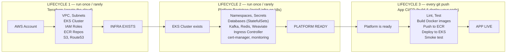

# Deployment Lifecycles

This folder documents the **three separate lifecycles** that take the US Law RAG system from zero to running in production. Each lifecycle changes at a different speed and is managed by different tooling — understanding this separation is the key to making sense of the overall deployment architecture.



---

## Documents

| Document | Lifecycle | Frequency | Description |
| --- | --- | --- | --- |
| [Terraform — Cloud Infrastructure](1-terraform-cloud-infrastructure.md) | 1 | Once, then on infra changes | Provisions VPC, EKS, ECR, IAM, S3, Route53 on AWS |
| [Platform Bootstrap](2-platform-bootstrap.md) | 2 | Once per cluster, then on config changes | Installs databases, middleware, secrets, monitoring onto the cluster |
| [App CI/CD](3-app-ci-cd.md) | 3 | Every git push | Builds images, runs tests, deploys application code with zero downtime |

---

## Why Three Lifecycles?

Docker Compose handles all three in one file — that is why local development feels simple. In production they must be separated because each layer changes at a **different speed**:

| Layer | Tool | Change frequency | Example change |
| --- | --- | --- | --- |
| Cloud infrastructure | Terraform | Months | Add a new node group, change instance type |
| Platform | Kustomize / Helm / kubectl | Weeks | Upgrade Postgres version, add a new secret |
| Application code | GitHub Actions + kubectl | Hours / daily | Fix a bug in auth-api, ship a new chat feature |

Deploying a bug fix should never touch Terraform. Upgrading a database should never trigger an application image build. This separation of concerns is the entire reason for the complexity.

---

## Full Timeline (End to End)

```
1. terraform apply
   └─ VPC, EKS, ECR, IAM roles now exist on AWS

2. Platform bootstrap
   ├─ helm install ingress-nginx, cert-manager, prometheus
   ├─ kubectl apply → namespaces, configmaps, secrets
   ├─ kubectl apply → StatefulSets (Postgres, Mongo, Redis, Weaviate, Cassandra, Kafka)
   └─ Database migrations (alembic, CQL scripts)

3. Developer pushes code
   └─ GitHub Actions
       ├─ detect which services changed
       ├─ lint + unit test changed services
       ├─ docker build + push to ECR
       ├─ kubectl set image → rolling update on EKS
       ├─ rollout status → wait for readiness probes
       └─ smoke test → done ✅
```

For application service architecture, see [Services](../services/README.md). For infrastructure files, see [Infra](../infra/README.md).
