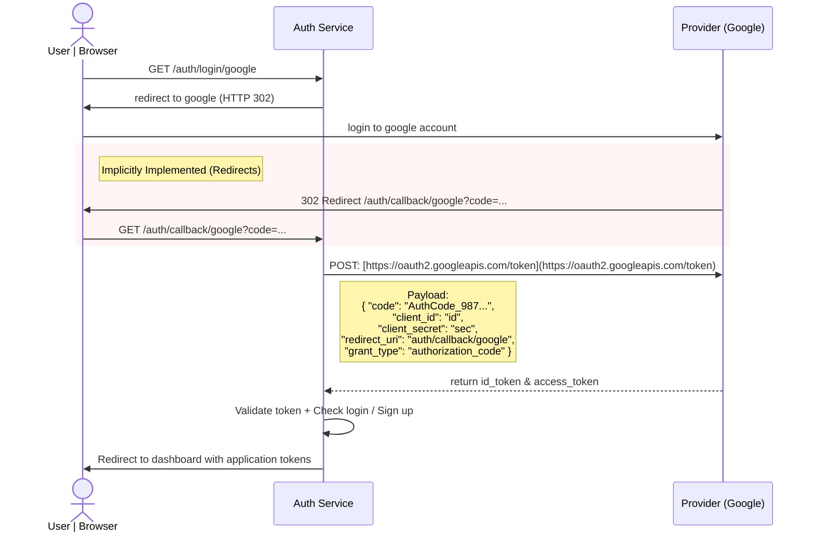

# Authentication & User Management Architecture

This document outlines the architecture and data flows for the newly introduced microservices: `auth_service`, `user_service`, and the `rest-gateway`.

## Architectural Overview

To handle user identity, security, and profile management, the system utilizes a decoupled microservices approach driven by an API Gateway and asynchronous event streaming.

- **REST Gateway**: The single entry point for client applications. Handles token validation.
- **Auth Service**: Manages identity, credentials, JWT generation, and OpenID Connect (OIDC) flows.
- **User Service**: A dedicated CRUD service for non-security user profile data.
- **Kafka (Pub/Sub)**: Facilitates asynchronous communication between Auth and User services.

---

## 1. Auth Service (`auth_service`)

The Auth Service is strictly responsible for identity verification and token lifecycle management.

### Security Mechanism

- **Asymmetric Cryptography (RS256)**: The service uses a **Private Key** (PEM) to sign and generate JWT access tokens. Configure via `JWT_PRIVATE_KEY` or `JWT_PRIVATE_KEY_PATH` in auth-api.
- **Public Key Distribution**: The corresponding **Public Key** (PEM) is used by the API Gateway and User API to verify tokens. Configure via `JWT_PUBLIC_KEY` or `JWT_PUBLIC_KEY_PATH` in api-gateway and user-api. Auth-api also needs the public key for verifying tokens on endpoints like `/me`.

### Database Models

_Implementation Note: While the Auth service utilizes PostgreSQL for robust relational mapping of credentials and federated identities, the ORM/ODM models are structured as follows:_

```python
# Core User Identity
class User(Document):
    username: str
    email: str
    password: str = "" # Empty if registered exclusively via OIDC (remember to hash before put in)

# OpenID Connect / Federated Login Mapping
class Federated(Document):
    user_id: str
    provider: str      # e.g., 'google', 'github'
    subject_id: str    # The unique ID provided by the external identity provider

# Token Lifecycle Management
class RefreshToken(Document):
    token: str
    user_id: PydanticObjectId
    expires_at: datetime
    revoked: bool = False
    created_at: datetime = Field(default_factory=datetime.now)
```

### Authentication Flows

#### Standard Login Flow

1. Client submits credentials.
2. `auth_service` verifies credentials and generates a short-lived access_token and a long-lived `refresh_token`.
3. If the `access_token` expires, the client submits the `refresh_token`. The service checks the database to ensure it exists, has not expired, and is not `revoked` before issuing a new `access_token`.

#### OIDC Authentication Flo(Google)

The system supports federated login via external providers. Below is the sequence for the Google OIDC flow:



#### Event Streaming (Kafka)

Upon successful new user registration (via standard sign-up or first-time OIDC login), the `auth_service` publishes a `UserCreated` event to an Apache Kafka topic. This ensures downstream services are notified without creating synchronous bottlenecks.

---

## 2. User Service (`user_service`)

The User Service handles all application-level user profile data (e.g., display names, preferences, avatars).

- **Database:** Utilizes **MongoDB** for flexible, document-based storage of user profiles.
- **Data Security: Strictly does not store passwords or security credentials**. It only stores references (like `user_id`) to map back to the Auth Service.
- **Lifecycle:** Acts as a Kafka consumer. When it receives a `UserCreated` event from the `auth_service`, it provisions a new profile document in MongoDB for that user. It also provides standard CRUD REST endpoints for updating profile information.
