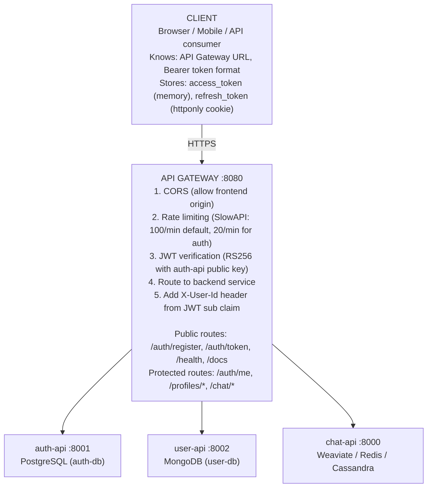
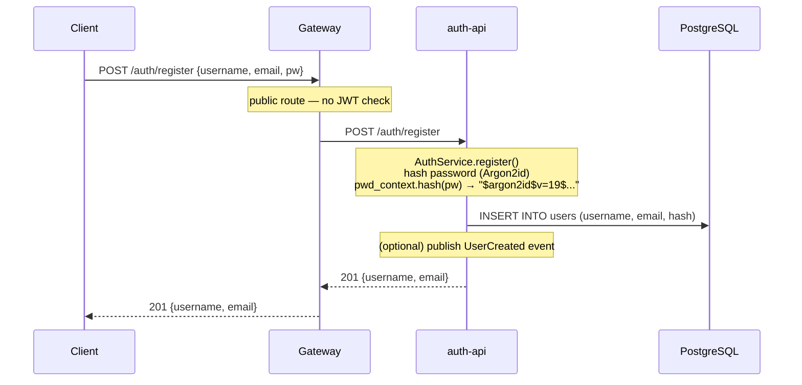
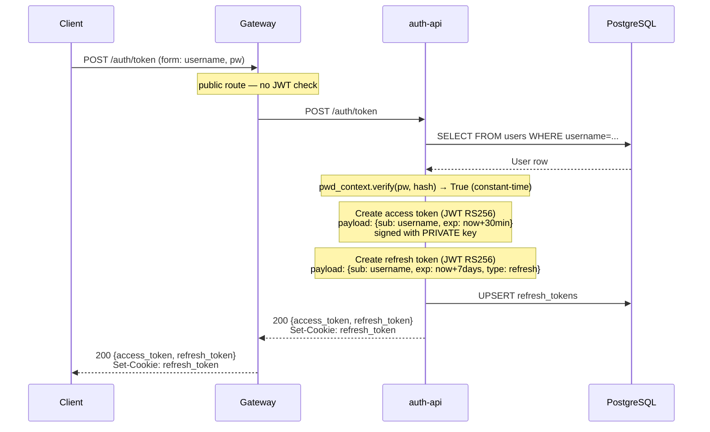
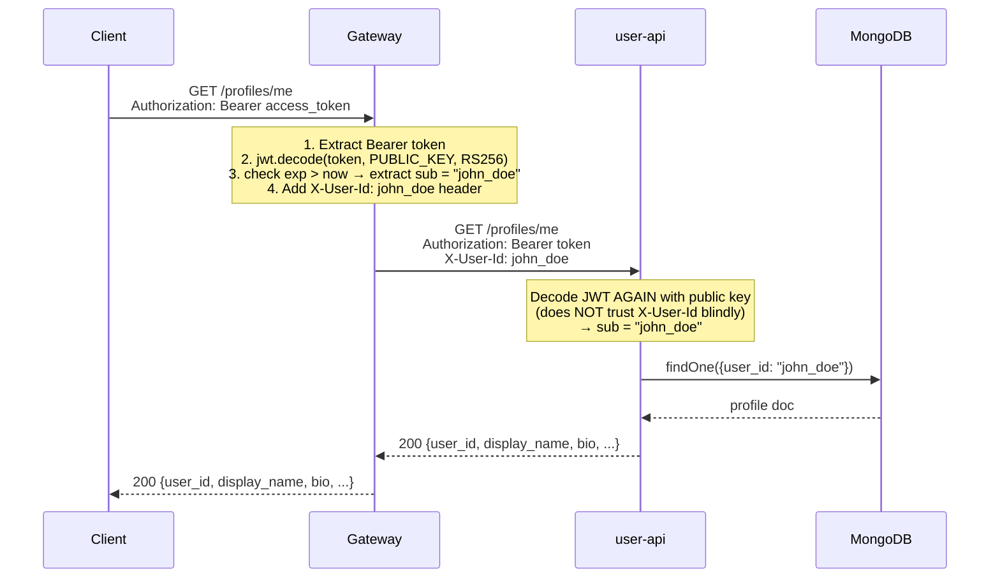
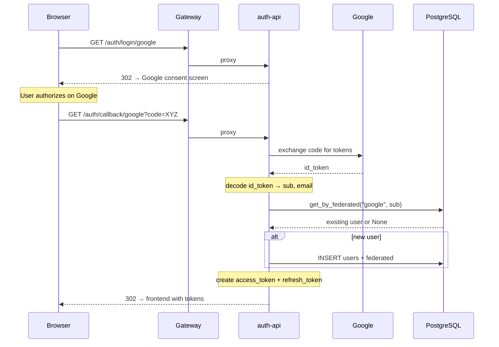
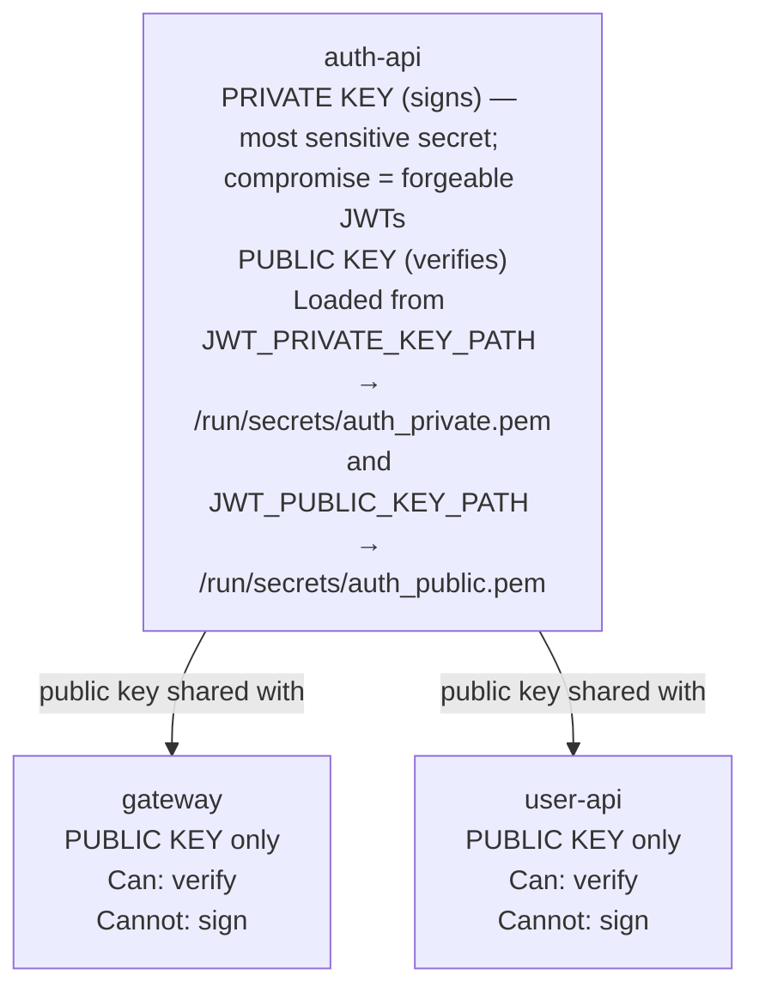

# Authentication & User Management Architecture

This document describes the complete authentication and user management system — how users register, log in, access protected resources, and manage their profiles across three cooperating services.

---

## Service Map

---

## Flow 1: Registration

### Password Hashing Details

| Property | Value |
| --- | --- |
| Algorithm | Argon2id |
| Memory cost | 65536 KB (64 MB) |
| Time cost | 3 iterations |
| Parallelism | 4 lanes |
| Salt | 16 bytes (auto-generated per hash) |
| Output hash | 32 bytes (base64-encoded in stored string) |

Argon2id is the recommended algorithm per OWASP. It is resistant to both GPU attacks (memory-hard) and side-channel attacks (data-independent memory access pattern in the id variant).

---

## Flow 2: Login (Token Issuance)

### Token Anatomy

**Access Token (30-minute lifetime):**

| Part | Value |
| --- | --- |
| Header | `{ "alg": "RS256", "typ": "JWT" }` |
| Payload | `{ "sub": "john_doe", "exp": 1709712000, "iat": 1709710200 }` |
| Signature | `RSA_SHA256(header.payload, PRIVATE_KEY)` |

**Refresh Token (7-day lifetime):**

| Part | Value |
| --- | --- |
| Header | `{ "alg": "RS256", "typ": "JWT" }` |
| Payload | `{ "sub": "john_doe", "exp": 1710316800, "iat": 1709710200, "type": "refresh" }` |
| Signature | `RSA_SHA256(header.payload, PRIVATE_KEY)` |

---

## Flow 3: Accessing a Protected Resource

### Why Double JWT Verification?

Both the gateway and user-api verify the JWT independently. This is **defense in depth**:

- If the gateway has a bug that skips JWT verification for certain paths, user-api still rejects unauthenticated requests
- user-api can be deployed behind a different gateway in the future without losing security
- The cost is negligible — RS256 verify is a single RSA public key operation (~0.1ms)

---

## Flow 4: Google OIDC Login

---

## RS256 Key Distribution

### Key Rotation Procedure

1. Generate new RSA key pair: `openssl genrsa -out private_new.pem 2048 && openssl rsa -in private_new.pem -pubout -out public_new.pem`
2. Deploy the new **public key** to gateway and user-api first (they now accept tokens signed by either old or new key)
3. Deploy the new **private key** to auth-api (new tokens are signed with new key)
4. Wait for all old tokens to expire (30 minutes for access tokens)
5. Remove the old public key from gateway and user-api

Step 2 before step 3 ensures there is no window where newly issued tokens are rejected.

---

## Configuration Reference

### auth-api

| Variable | Default | Description |
| --- | --- | --- |
| `AUTH_DB_URL` | (empty) | PostgreSQL connection string |
| `JWT_PRIVATE_KEY_PATH` | (empty) | Path to RS256 private key PEM |
| `JWT_PUBLIC_KEY_PATH` | (empty) | Path to RS256 public key PEM |
| `JWT_ALGORITHM` | `RS256` | Signing algorithm |
| `SESSION_SECRET_KEY` | (required) | Starlette session secret (for OIDC state) |
| `ACCESS_TOKEN_EXPIRE_MINUTES` | `30` | Access token TTL |
| `REFRESH_TOKEN_EXPIRE_DAYS` | `7` | Refresh token TTL |
| `GOOGLE_CLIENT_ID` | (empty) | Google OIDC |
| `GOOGLE_CLIENT_SECRET` | (empty) | Google OIDC |
| `GOOGLE_REDIRECT_URI` | (empty) | Google OIDC callback URL |

### api-gateway

| Variable | Default | Description |
| --- | --- | --- |
| `JWT_PUBLIC_KEY_PATH` | (empty) | Path to RS256 public key PEM |
| `JWT_ALGORITHM` | `RS256` | Verification algorithm |
| `AUTH_API_URL` | `http://auth-api:8001` | Upstream auth-api |
| `USER_API_URL` | `http://user-api:8002` | Upstream user-api |
| `CHAT_API_URL` | `http://chat-api:8000` | Upstream chat-api |
| `CORS_ORIGINS` | `["http://localhost:3000"]` | Allowed origins |
| `RATE_LIMIT_DEFAULT` | `100/minute` | Rate limit for most routes |

### user-api

| Variable | Default | Description |
| --- | --- | --- |
| `JWT_PUBLIC_KEY_PATH` | (empty) | Path to RS256 public key PEM |
| `JWT_ALGORITHM` | `RS256` | Verification algorithm |
| `USER_DB_URL` | `mongodb://user-db:27017/user_db` | MongoDB connection |

---

## Security Checklist

| Check | Status | Notes |
| --- | --- | --- |
| Passwords hashed with Argon2id | Done | Via Passlib CryptContext |
| JWT signed with RS256 (asymmetric) | Done | Private key only on auth-api |
| Refresh tokens stored server-side | Done | PostgreSQL `refresh_tokens` table |
| Refresh token in httponly cookie | Done | JS cannot access |
| CORS restricted | Done | Only `localhost:3000` by default |
| Rate limiting | Done | SlowAPI on gateway |
| OIDC state validated | Done | Starlette SessionMiddleware |
| Public key only on verifiers | Done | Gateway + user-api have no private key |
| Token expiration checked | Done | `exp` claim verified by jose |
