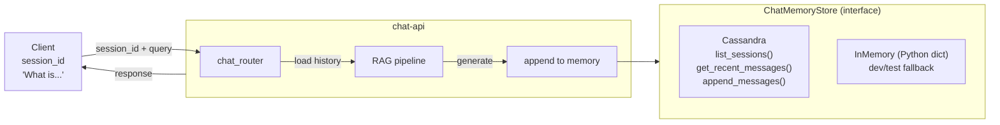
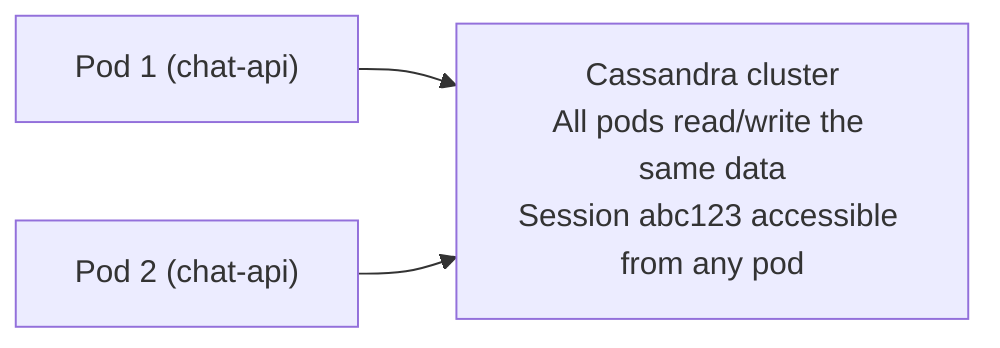

# Chat Memory Architecture

## 1. Overview

LLMs are stateless — they have no memory of previous messages. To support multi-turn conversations and provide conversation context for RAG, chat history must be stored externally and injected into each LLM call. This project uses a **pluggable store** pattern with a Cassandra implementation for production and an in-memory implementation for dev and tests.

---

## 2. Architecture



---

## 3. Interface

**Source:** `app/chat-api/src/chat_memory/store.py`

```python
class ChatMemoryStore:
    def list_sessions(self, limit: int = 50) -> List[str]:
        """Return session IDs, most recently updated first."""
        raise NotImplementedError

    def get_recent_messages(self, session_id: str, limit: int = 20) -> List[ChatMessageRecord]:
        """Return the most recent messages for a session, ordered by timestamp."""
        raise NotImplementedError

    def append_messages(self, messages: List[ChatMessageRecord]) -> None:
        """Append one or more messages to the store."""
        raise NotImplementedError
```

### Data Model

**Source:** `app/chat-api/src/chat_memory/models.py`

```python
class ChatMessageRecord(BaseModel):
    session_id: str           # groups messages into conversations
    timestamp: datetime       # ordering within a session
    role: str                 # "user" or "assistant"
    content: str              # the message text
```

### Service Layer

**Source:** `app/chat-api/src/chat_memory/service.py`

`ChatMemoryService` wraps the store and provides convenience methods used by the router:

```python
class ChatMemoryService:
    def __init__(self, store: ChatMemoryStore):
        self._store = store

    def list_sessions(self, limit=50): return self._store.list_sessions(limit)
    def get_recent_messages(self, sid, limit=20): return self._store.get_recent_messages(sid, limit)
    def append_messages(self, messages): return self._store.append_messages(messages)
```

---

## 4. Cassandra Implementation (Production)

### Connection

```python
class CassandraChatMemoryStore(ChatMemoryStore):
    def __init__(self, contact_points="cassandra:9042", keyspace="chat_memory"):
        hosts = [hp.strip() for hp in contact_points.split(",")]
        self._cluster = Cluster(hosts)
        self._session = self._cluster.connect()
        self._ensure_schema(keyspace)
        self._session.set_keyspace(keyspace)
```

### Schema Auto-Creation

On first connection, the store creates the keyspace and tables if they do not exist:

```cql
CREATE KEYSPACE IF NOT EXISTS chat_memory
WITH replication = { 'class': 'SimpleStrategy', 'replication_factor': '1' };

CREATE TABLE IF NOT EXISTS chat_memory.messages (
    session_id text,
    timestamp  timestamp,
    role       text,
    content    text,
    PRIMARY KEY (session_id, timestamp)
) WITH CLUSTERING ORDER BY (timestamp ASC);

CREATE TABLE IF NOT EXISTS chat_memory.sessions (
    session_id text PRIMARY KEY,
    updated_at timestamp
);
```

### Partition Model

**messages table — Partition: session_id = "abc123"**

| timestamp | role | content |
| --- | --- | --- |
| 2025-03-01T12:00:00Z | user | What is habeas corpus? |
| 2025-03-01T12:00:05Z | assistant | Habeas corpus... |
| 2025-03-01T12:01:00Z | user | And Miranda? |
| 2025-03-01T12:01:04Z | assistant | Miranda rights... |

**Partition: session_id = "def456"**

| timestamp | role | content |
| --- | --- | --- |
| 2025-03-02T09:00:00Z | user | Tax fraud laws? |
| 2025-03-02T09:00:08Z | assistant | Under Title 26... |

All messages for a session are co-located on the same Cassandra node (same partition). Reading the last 20 messages for a session is a single-partition read — the fastest possible operation in Cassandra.

### Query Implementation

**get_recent_messages:**

```python
rows = self._session.execute(
    "SELECT session_id, timestamp, role, content FROM messages "
    "WHERE session_id=%s ORDER BY timestamp ASC LIMIT %s",
    (session_id, limit),
)
```

Single-partition, ordered by clustering key — reads the last `limit` rows from one sorted block on one node. O(1) seek + O(limit) scan.

**append_messages:**

```python
for msg in messages:
    self._session.execute(
        "INSERT INTO messages (session_id, timestamp, role, content) VALUES (%s, %s, %s, %s)",
        (msg.session_id, msg.timestamp, msg.role, msg.content),
    )
    self._session.execute(
        "INSERT INTO sessions (session_id, updated_at) VALUES (%s, %s)",
        (msg.session_id, msg.timestamp),
    )
```

Each message append is 2 INSERT operations (message + session tracker). Cassandra INSERTs are upserts — no read-before-write.

---

## 5. In-Memory Implementation (Dev/Test)

```python
class InMemoryChatMemoryStore(ChatMemoryStore):
    def __init__(self):
        self._data: Dict[str, List[ChatMessageRecord]] = defaultdict(list)

    def list_sessions(self, limit=50):
        return list(self._data.keys())[-limit:]

    def get_recent_messages(self, session_id, limit=20):
        items = self._data.get(session_id, [])
        return sorted(items, key=lambda m: m.timestamp)[-limit:]

    def append_messages(self, messages):
        for msg in messages:
            self._data[msg.session_id].append(msg)
```

**Limitations:**
- Data is lost when the process restarts
- Not shared across multiple chat-api pods
- No ordering guarantee beyond Python sort
- No TTL or automatic cleanup

**Use cases:**
- `docker-compose.light.yml` (no Cassandra container)
- Unit tests (no external dependencies)
- Local development with `uvicorn --reload`

---

## 6. Store Selection (Startup)

**Source:** `app/chat-api/src/api/main.py`

```python
try:
    memory_store = CassandraChatMemoryStore()
except Exception:
    memory_store = InMemoryChatMemoryStore()
chat_memory = ChatMemoryService(memory_store)
app.state.chat_memory = chat_memory
```

The selection is **environment-driven** — no feature flag. If the `cassandra-driver` package is installed and the Cassandra service is reachable, it uses Cassandra. Otherwise, it silently falls back to in-memory.

```
Environment                  What happens
─────────────────────────    ────────────────────────────────
docker-compose.yml           Cassandra container running → CassandraChatMemoryStore
docker-compose.light.yml     No Cassandra → connection fails → InMemoryChatMemoryStore
pytest                       No Cassandra → InMemoryChatMemoryStore (or mocked)
Kubernetes (prod)            Cassandra StatefulSet → CassandraChatMemoryStore
```

---

## 7. Full Data Flow (Per Chat Request)

```
1. Client sends: POST /chat/ with X-Session-Id: abc123
   Body: { "content": "What is habeas corpus?" }

2. chat_router extracts session_id from header

3. Load conversation context:
   chat_memory.get_recent_messages("abc123", limit=20)
   → Cassandra: SELECT ... WHERE session_id='abc123' LIMIT 20
   → Returns 4 previous messages (2 exchanges)

4. Build LLM input:
   system_prompt + conversation_history + retrieved_chunks + user_query

   ```
   System: You are a legal assistant...

   Previous conversation:
   User: What are Miranda rights?
   Assistant: Miranda rights are...

   Retrieved context:
   [Chunk 1] Source: Black's Law Dictionary...
   [Chunk 2] Source: Boumediene v. Bush...

   User: What is habeas corpus?
   ```

5. LLM generates response:
   "Habeas corpus is a legal principle that requires..."

6. Append to chat memory:
   chat_memory.append_messages([
     ChatMessageRecord("abc123", now, "user", "What is habeas corpus?"),
     ChatMessageRecord("abc123", now+5s, "assistant", "Habeas corpus is..."),
   ])
   → Cassandra: INSERT INTO messages ... (x2)
   → Cassandra: INSERT INTO sessions ... (update tracker)

7. Return response to client
```

---

## 8. Why Conversation Context Matters for RAG

Without chat memory, each query is independent:

```
User: "What is the penalty for tax fraud?"
Bot:  "Tax fraud carries penalties under 26 U.S.C. § 7201..."

User: "What about for individuals vs corporations?"
Bot:  "I don't have enough context to answer this question."  ← no memory of previous Q
```

With chat memory, the LLM sees the conversation history:

```
User: "What is the penalty for tax fraud?"
Bot:  "Tax fraud carries penalties under 26 U.S.C. § 7201..."

User: "What about for individuals vs corporations?"
Bot:  "For individuals, 26 U.S.C. § 7201 provides up to 5 years imprisonment
       and $100,000 in fines. For corporations, the fine limit is $500,000..."
       ← understands "what about" refers to tax fraud penalties
```

The chat memory provides the LLM with conversational context so it can resolve pronouns ("it"), references ("that case"), and follow-up questions ("what about?") that would otherwise be ambiguous.

---

## 9. Scaling Considerations

### Multiple chat-api pods



With Cassandra, any chat-api pod can serve any session. With in-memory store, each pod has its own isolated data — a user would need to always hit the same pod (sticky sessions).

### Partition size limits

Cassandra performs best when partitions are < 100 MB. With ~1 KB per message, a single session can hold ~100K messages before performance degrades. For a chat application, this is effectively unlimited (most conversations are < 100 messages).

### TTL for automatic expiry

```cql
INSERT INTO messages (session_id, timestamp, role, content)
VALUES ('abc123', '2025-03-01T12:00:00Z', 'user', 'question')
USING TTL 2592000;   -- 30 days
```

After the TTL, rows become tombstones and are eventually compacted. This keeps storage bounded without manual cleanup.
