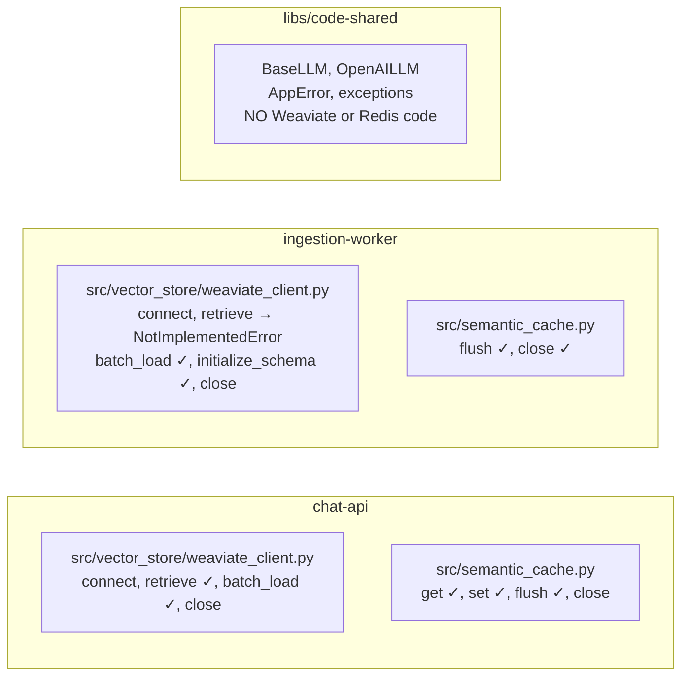

# RAG and Ingestion Architecture

## 1. Overview

The system provides a **Retrieval-Augmented Generation (RAG)** pipeline for US law Q&A. Legal documents (PDFs of statutes, case law, regulations) are ingested into a vector store. At query time, the pipeline retrieves relevant document chunks, reranks them for relevance, builds a context window, and generates an answer via an LLM. A semantic cache short-circuits repeated or similar queries.

Two services collaborate:
- **Ingestion worker** — writes documents into the vector store (offline, batch)
- **Chat API** — reads from the vector store and runs the RAG pipeline (online, per-query)

---

## 2. System Diagram

```mermaid
flowchart TD
    subgraph ING["INGESTION (offline)"]
        PDF["Legal PDFs (data/)"]
        DOC["Docling (convert)"]
        LC["LegalChunker (chunk)"]
        OAI["OpenAI Embed (vectorize)"]
        WV_W["Weaviate (store)"]
        RD_FL["Redis (flush semantic cache after ingest)"]

        PDF --> DOC --> LC --> OAI --> WV_W
        WV_W --> RD_FL
    end

    subgraph QUERY["QUERY (online)"]
        UQ["User question"]
        SC["Semantic Cache (Redis)"]
        CACHED["Return cached response"]
        WV_R["Weaviate (embed query → top-25 chunks)"]
        BM25["BM25 Reranker (top-10)"]
        COHERE["Cohere Reranker (top-5)"]
        CTX["Context Builder (formatted text)"]
        LLM["OpenAI LLM (answer)"]
        CACHE_MEM["Cache + Memory append"]

        UQ --> SC
        SC -- "hit" --> CACHED
        SC -- "miss" --> WV_R --> BM25 --> COHERE --> CTX --> LLM --> CACHE_MEM
    end
```



---

## 3. Ingestion Pipeline (Detailed)

**Source:** `app/ingestion-worker/`
**Entrypoint:** `src/main.py` — CLI script, not an HTTP server

### Step-by-Step

```
$ python -m src.main --data ./data --recreate
```

#### Step 1: Parse arguments

```python
parser.add_argument("--recreate", action="store_true")   # drop + recreate collection
parser.add_argument("--data", default="./data")           # PDF folder
```

#### Step 2: Connect to Weaviate

```python
db = WeaviateClient(
    weaviate_url="http://weaviate:8080",
    weaviate_class_name="document_chunk_embedding",
    openai_api_key=settings.OPENAI_API_KEY,
    openai_embedding_model="text-embedding-3-large",
)
db.connect()
```

#### Step 3: Initialize schema (if `--recreate`)

```python
if args.recreate:
    db.initialize_schema(recreate=True)
    # Drops existing collection → creates fresh one
    # All existing vectors are deleted
```

The schema defines:
- Collection name: `document_chunk_embedding`
- Properties: `text` (TEXT), `source` (TEXT)
- Vectorizer: `none` (self-provided embeddings)

#### Step 4: Process documents

```python
processor = IngestionProcessor(vector_store=db)
processor.run(str(args.data))
```

Inside `IngestionProcessor.run()`:

```
For each PDF in data/:
  1. Convert PDF to text
     → Docling library extracts text with structure awareness
     → Handles multi-column layouts, headers/footers, page numbers

  2. Chunk text into sections
     → LegalChunker (src/chunker.py) splits on legal boundaries:
       - Section markers (§, Article, Chapter)
       - Paragraph breaks
       - Respects statute numbering
     → Output: List[Dict] with "text" and "source" keys

  3. Batch load into Weaviate
     → For each chunk:
        a. embed_model.get_text_embedding(chunk["text"])
           → OpenAI API call → returns 3072-float vector
        b. batch.add_object(properties=chunk, vector=vector)
     → Weaviate's dynamic batching flushes automatically
```

#### Step 5: Flush semantic cache

```python
cache = SemanticCache(redis_url=settings.REDIS_URL, ...)
if cache.enabled:
    cache.flush()       # delete all rag_cache:* keys + drop index
    cache.close()
```

**Why flush?** If the user asked "What is the penalty for tax fraud?" yesterday and got a cached answer, then today we ingest new tax law documents, the cached answer might be outdated. Flushing forces the next query through the full pipeline with the updated Weaviate data.

### LegalChunker Details

**Source:** `app/ingestion-worker/src/chunker.py`

Legal documents have specific structure that generic text splitters would destroy:

```
WRONG (generic character-count splitter):
  "...Section 1341 Frauds and swindles. Whoever, having devised or intending
   to devise any scheme or artifice to defraud, or for obtaining mon"
  ← cuts mid-sentence, loses section boundary

RIGHT (LegalChunker):
  {
    "text": "Section 1341 Frauds and swindles. Whoever, having devised or
             intending to devise any scheme or artifice to defraud, or for
             obtaining money or property by means of false or fraudulent
             pretenses, representations, or promises...",
    "source": "USC Title 18 § 1341"
  }
  ← complete section with source metadata
```

---

## 4. RAG Pipeline (Detailed)

**Source:** `app/chat-api/src/api/services/rag_pipeline.py`

### `answer()` — non-streaming

```python
def answer(db, llm, first_reranker, second_reranker, query, *,
           semantic_cache=None, get_query_embedding=None) -> str:
```

#### Phase 1: Semantic Cache Check

```python
if semantic_cache and semantic_cache.enabled and get_query_embedding:
    query_embedding = get_query_embedding(query)    # OpenAI API call (~100ms)
    cached = semantic_cache.get(query_embedding)     # Redis KNN search (~1ms)
    if cached is not None:
        return cached                                # total: ~100ms
```

If cache hits, the function returns immediately — no Weaviate, no rerankers, no LLM. Cost: 1 embedding API call. Savings: 1 LLM call + 1 Cohere API call.

#### Phase 2: Vector Retrieval

```python
vec_docs = db.retrieve(query, top_k=25)
```

What happens:
1. Query text → OpenAI embedding (3072 dims) — ~100ms
2. Embedding → Weaviate near_vector HNSW search — ~10ms
3. Returns top 25 document chunks sorted by cosine similarity
4. Each chunk: `{ "text": "...", "source": "USC Title 18 § 1341" }`

**Why 25?** Retrieving more candidates gives the rerankers a larger pool to work with. The rerankers will narrow it down to the best 5. Retrieving too few (e.g., 5) risks missing relevant chunks that are slightly lower in vector similarity but highly relevant lexically or semantically.

#### Phase 3: First Rerank (BM25)

```python
filtered_docs = first_reranker.rerank(query, vec_docs)   # → ~10 chunks
```

BM25 (Best Matching 25) is a lexical scoring function:

```
score(query, doc) = Σ IDF(term) × (tf(term, doc) × (k1 + 1)) / (tf(term, doc) + k1 × (1 - b + b × |doc|/avgdl))
```

- **TF** = term frequency in the document
- **IDF** = inverse document frequency across all documents
- **k1** = 1.2 (term saturation parameter)
- **b** = 0.75 (document length normalization)

This catches cases where the vector search missed a lexically relevant chunk. For example, if the query contains the specific statute number "§ 1341", BM25 will score documents mentioning "1341" highly, even if the vector embeddings are not the closest.

**Speed:** Runs locally in Python, no API call. ~1ms for 25 documents.

#### Phase 4: Second Rerank (Cohere)

```python
final_docs = second_reranker.rerank(query, filtered_docs)   # → ~5 chunks
```

Cohere's reranker is a **cross-encoder** neural model:
- Takes (query, document) pairs as input
- Jointly encodes both and produces a relevance score
- Much more accurate than vector similarity (which encodes query and doc separately)
- But much slower (~200ms for 10 documents via API call)

This is why we use BM25 first — reducing 25 → 10 before sending to the expensive Cohere API.

#### Phase 5: Context Building

```python
context = transform(final_docs)
```

Output format:

```
[Chunk 1]
Source: USC Title 18 § 1341
Content:
Section 1341 Frauds and swindles. Whoever, having devised or intending
to devise any scheme or artifice to defraud...

[Chunk 2]
Source: Katz v. United States, 389 U.S. 347
Content:
The Fourth Amendment protects people, not places. What a person knowingly
exposes to the public, even in his own home or office, is not a subject of
Fourth Amendment protection...
```

#### Phase 6: LLM Generation

```python
response = llm.generate(query, context)
```

The LLM receives:
1. **System prompt** (from `app/chat-api/src/prompts/`) — instructs the model to be a legal assistant, cite sources, and stay within the provided context
2. **Context** — the formatted chunk text from Phase 5
3. **Query** — the user's question

| Section | Content |
| --- | --- |
| **System Prompt** | You are a legal research assistant. Answer based only on the provided context. Cite your sources. If the context does not contain the answer, say you don't have enough information. |
| **Context** | [Chunk 1] Source: USC Title 18 § 1341 ...<br/>[Chunk 2] Source: Katz v. United States ... |
| **User Query** | What does the Fourth Amendment protect against? |

#### Phase 7: Cache Result

```python
if semantic_cache and semantic_cache.enabled and get_query_embedding:
    query_embedding = get_query_embedding(query)
    semantic_cache.set(query_embedding, response)
```

Stores the embedding + response in Redis with a 24-hour TTL. The next similar query will hit the cache.

### `answer_stream()` — streaming

Same pipeline, but Phase 6 uses `llm.generate_stream()` which yields tokens one at a time:

```python
for chunk in llm.generate_stream(query, context):
    chunks.append(chunk)
    yield chunk

# After streaming completes, cache the full response
full_response = "".join(chunks)
semantic_cache.set(query_embedding, full_response)
```

The WebSocket handler forwards each yielded chunk to the client in real time. The user sees tokens appearing progressively instead of waiting for the entire response.

---

## 5. Ownership Model (ADR 003)



Each service has its **own** Weaviate client and semantic cache module. They are not imported from a shared library. This was a deliberate decision (ADR 003) to:
- Avoid pulling heavy dependencies (weaviate-client, redis) into every service
- Allow independent evolution (chat-api's retrieve logic vs ingestion-worker's batch load)
- Keep ownership clear (chat-api owns retrieval; ingestion-worker owns writing)

**Contract between services:** Both services must use the same:
- `WEAVIATE_CLASS_NAME` — same Weaviate collection
- `OPENAI_EMBEDDING_MODEL` — same embedding dimensions
- `CACHE_PREFIX` / `INDEX_NAME` — same Redis key namespace for cache invalidation

---

## 6. Latency Breakdown

| Phase | Component | Latency | Cost per query |
| --- | --- | --- | --- |
| Embedding | OpenAI text-embedding-3-large | ~100ms | ~$0.0001 |
| Cache check | Redis KNN search | ~1ms | Free |
| Retrieval | Weaviate HNSW | ~10ms | Free (self-hosted) |
| BM25 rerank | Local Python | ~1ms | Free |
| Cohere rerank | Cohere API | ~200ms | ~$0.001 |
| LLM generation | OpenAI GPT-4o | ~2-4s | ~$0.01-0.03 |
| Cache store | Redis HSET | ~1ms | Free |
| Memory append | Cassandra INSERT | ~5ms | Free (self-hosted) |
| **Total (cache miss)** | | **~2.5-4.5s** | **~$0.01-0.03** |
| **Total (cache hit)** | | **~100ms** | **~$0.0001** |

The LLM is the bottleneck in both latency and cost. The semantic cache eliminates both for repeated queries.

---

## 7. Configuration Reference

### chat-api

| Variable | Default | Description |
| --- | --- | --- |
| `OPENAI_API_KEY` | (required) | For embeddings and LLM |
| `OPENAI_LLM_MODEL` | `gpt-4o` | LLM model |
| `OPENAI_EMBEDDING_MODEL` | `text-embedding-3-large` | Embedding model (3072 dims) |
| `WEAVIATE_URL` | `http://localhost:8080` | Weaviate endpoint |
| `WEAVIATE_CLASS_NAME` | `document_chunk_embedding` | Collection name |
| `REDIS_URL` | `redis://localhost:6379` | Redis for semantic cache |
| `CACHE_TTL_SECONDS` | `86400` | Cache entry lifetime (24h) |
| `CACHE_SIMILARITY_THRESHOLD` | `0.95` | Min cosine similarity for hit |
| `CACHE_EMBED_DIM` | `3072` | Must match embedding model |
| `RERANKER_BM25_TOP_K` | `10` | Chunks after BM25 |
| `RERANKER_COHERE_TOP_K` | `5` | Chunks after Cohere |

### ingestion-worker

| Variable | Default | Description |
| --- | --- | --- |
| `OPENAI_API_KEY` | (required) | For computing embeddings |
| `OPENAI_EMBEDDING_MODEL` | `text-embedding-3-large` | Must match chat-api |
| `WEAVIATE_URL` | `http://localhost:8080` | Must match chat-api |
| `WEAVIATE_CLASS_NAME` | `document_chunk_embedding` | Must match chat-api |
| `REDIS_URL` | `redis://localhost:6379` | For cache flush |
| `CACHE_TTL_SECONDS` | `86400` | (unused but present for SemanticCache init) |
| `CACHE_SIMILARITY_THRESHOLD` | `0.95` | (unused) |
| `CACHE_EMBED_DIM` | `3072` | Must match chat-api |

---

## 8. Error Handling and Graceful Degradation

| Failure | Behavior | Impact |
| --- | --- | --- |
| Redis unreachable | Semantic cache disabled (`enabled=False`) | Every query runs full pipeline (slower, costlier) |
| Weaviate unreachable | `db.connect()` fails at startup | chat-api crashes (intentional — cannot serve without vectors) |
| Cohere API error | `second_reranker.rerank()` raises | Pipeline fails, 500 returned to client |
| OpenAI API error | Embedding or LLM call fails | Pipeline fails, 500 returned to client |
| Cassandra unreachable | Falls back to InMemoryChatMemoryStore | Chat works but no persistent history |

**Design philosophy:** Vector store and LLM are **hard dependencies** — the system cannot function without them. Redis and Cassandra are **soft dependencies** — the system degrades gracefully without them.
